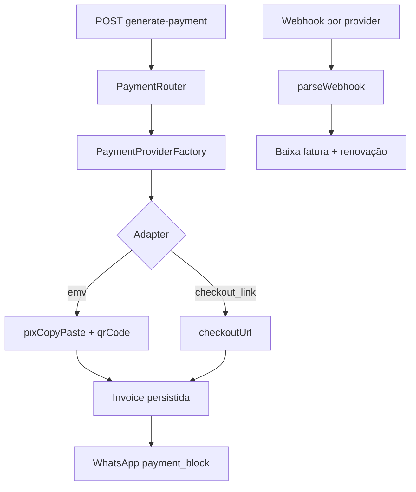

# Integrações — PIX, pagamento híbrido e WhatsApp

## Posso criar meu “próprio” PIX?

### O que a lei/marketplace exige

**PIX como meio de pagamento** para terceiros exige ser **Participante PIX** (instituição autorizada BACEN) ou usar um **PSP/agregador** (Asaas, Efi, Mercado Pago, PushinPay, InfinitePay, banco).

Você **não** vai implementar:

- Chave DICT, SPI, liquidação no Banco Central  
- QR Code EMV sem PSP  

Isso não é um projeto de app — é instituição financeira.

### O que você **cria no seu sistema** (correto e suficiente)

Seu **módulo de pagamento interno** com **dois formatos de entrega** (híbrido):

| Formato | O que o cliente recebe | PSPs típicos | WhatsApp |
|---------|------------------------|--------------|----------|
| **`emv`** | PIX copia e cola (+ QR opcional) | Asaas, Mercado Pago, Efi, PushinPay | “PIX copia e cola: …” |
| **`checkout_link`** | URL de checkout (PIX ou cartão na página do PSP) | InfinitePay | “Pague aqui: https://…” |

```
integrations/payment/
├── payment-provider.interface.ts   # contrato unificado + deliveryType
├── asaas.provider.ts               # emv — taxa fixa, valores altos
├── mercadopago.provider.ts         # emv — percentual, valores baixos
├── efi.provider.ts                 # emv — percentual (futuro)
├── pushinpay.provider.ts           # emv — percentual, split (futuro)
├── infinitypay.provider.ts         # checkout_link — link no Zap (futuro)
├── payment-router.service.ts       # escolhe PSP por amountCents + preferência
├── payment-message.util.ts         # bloco WhatsApp / UI por deliveryType
├── payment-fee.util.ts             # opcional: preview de taxa
└── payment-provider.factory.ts     # credencial por accountId + provider
```

Ver roteamento completo em [10-billing-dual-layer.md](./10-billing-dual-layer.md#roteamento-de-psp-por-valor--detalhe).

**Princípio híbrido:** um motor de billing, **uma cobrança ativa por fatura**, formato definido pelo adapter escolhido. Não gerar Asaas + InfinitePay na mesma fatura.

Responsabilidades **suas**:

| Responsabilidade | Onde |
|------------------|------|
| Quando gerar cobrança | `automation` + `billing` |
| Valor, vencimento, ciclo | `invoice` |
| Formato de entrega (EMV vs link) | adapter + `Invoice.paymentDeliveryType` |
| Idempotência webhook | `billing` |
| Baixa e fila renovação | `billing` → evento → `renewals` |
| **Aviso WhatsApp ao tenant (pagamento recebido)** | `PaymentReceivedNotificationService` após `confirm` |
| Relatório pós-pagamento | `reports` |

### Notificação ao revendedor (pagamento recebido)

Quando uma fatura **tenant** é baixada (webhook PSP ou pagamento manual), o sistema envia WhatsApp para o revendedor:

- **Provider:** mesma instância Evolution de Configurações → WhatsApp  
- **Destino:** telefone da conta (`Account.phone`) ou `PAYMENT_NOTIFY_PHONE` no `.env` da API (dev)  
- **Mensagem:** cliente, valor, ciclo, forma de pagamento; ativações pendentes se houver  
- **Resiliência:** falha no envio **não** desfaz a baixa (apenas log)

**Conclusão:** “mecanismo PIX próprio” = **seu domínio + adapters plugáveis**, não substituir o Banco Central.

---

## PSPs suportados (roadmap)

| Provider | Entrega | Taxa típica | Melhor para | MVP |
|----------|---------|-------------|-------------|-----|
| **Asaas** | `emv` | ~R$ 1,99 fixo/cobrança | Anuais, SaaS plataforma | ✅ 1º |
| **Mercado Pago** | `emv` | percentual | Mensalidades baixas | ✅ 2º |
| **Efi** | `emv` | percentual | Alternativa percentual | futuro |
| **PushinPay** | `emv` | percentual; `split_rules` | Revenda, bots, copia e cola no Zap | futuro |
| **InfinitePay** | `checkout_link` | PIX taxa zero (conta deles) | Link no WhatsApp, sem EMV inline | futuro |

### PushinPay (EMV)

- `POST /pix/cashIn` → `qr_code` (copia e cola) + `qr_code_base64`
- Webhook por cobrança (`webhook_url` na criação): `id`, `value`, `status`, `end_to_end_id`
- `split_rules` para divisão entre contas PushinPay (opcional; hoje cada tenant usa credencial própria)
- Credencial: **Bearer token** → `tenant_payment_credentials.apiKey`

### InfinitePay (link de checkout)

- `POST https://api.checkout.infinitepay.io/links` → URL `checkout.infinitepay.com.br/...`
- Cliente paga PIX ou cartão **fora** do app; ideal para **mandar link no WhatsApp**
- Webhook: `order_nsu`, `invoice_slug`, `capture_method`, etc.
- Credencial: **`handle`** (InfiniteTag, sem `$`) — campo dedicado ou extensão em credenciais

---

## Mecanismo híbrido — desenho



### Estratégias de roteamento (tenant)

| Modo | Comportamento |
|------|---------------|
| **`auto`** (default) | Router por `minAmountCents`; adapter define EMV ou link |
| **`emv_only`** | Só providers com `deliveryType = emv` |
| **`link_only`** | Só InfinitePay (se credenciado) |
| **`emv_preferred`** | Tenta EMV; fallback para link se nenhum EMV ativo |

Config futura: `tenant_payment_preferences.deliveryMode` (ver doc 10).

### Invariantes (não negociar)

1. **Uma fatura = uma cobrança ativa** — não misturar dois PSPs na mesma fatura.
2. Ao gerar pagamento, gravar `paymentProvider`, `paymentDeliveryType`, `providerChargeId` e **EMV ou link** — **nunca trocar PSP** depois que a cobrança existir no PSP.
3. Webhook reconcilia via `providerChargeId` (ou `order_nsu` mapeado) → invoice → adapter do `paymentProvider` persistido.
4. Endpoint HTTP pode manter alias `generate-pix` por compatibilidade; implementação interna = **`generatePayment`**.

---

## Por onde começar (custo baixo)

1. Conta **sandbox Asaas** + segundo PSP EMV (Mercado Pago ou Efi)  
2. Implementar adapters EMV + webhook idempotente  
3. `PaymentRouter`: limiar configurável por tenant (`tenant_payment_routing_rules`)  
4. Webhook: `POST /api/webhooks/payment/platform` e `/:tenantSlug/:provider`  
5. **Depois:** adapter InfinitePay (link) + `payment-message.util` para WhatsApp  
6. **Opcional:** PushinPay como 4º provider EMV se revendedores já usarem  

---

## Posso criar meu “próprio” WhatsApp?

### Opções reais

| Abordagem | O que é | Prós | Contras |
|-----------|---------|------|---------|
| **Evolution API / Baileys** | Automatiza WhatsApp Web | Barato, flexível | Risco de **ban**; viola ToS se uso massivo |
| **WhatsApp Business API (Meta)** | Oficial | Estável, templates | Custo, aprovação, templates para proativo |
| “Criar do zero” | Reimplementar protocolo | — | **Inviável** e ilegal/instável |

Você **não** cria o protocolo WhatsApp. Cria:

```
integrations/whatsapp/
├── whatsapp-provider.interface.ts
├── evolution.provider.ts
└── official-meta.provider.ts   # futuro
```

### O que é seu no WhatsApp

- Templates com `{{nome}}`, `{{vencimento}}`, `{{valor}}`
- **`{{payment_block}}`** — texto gerado pelo sistema (PIX ou link), substituindo `{{pix}}` fixo
- Fila BullMQ `message-sender`
- `message_log`, regras D-N ligadas à automação
- **Um número por tenant** (`tenant_whatsapp_config`)

#### Exemplos de `payment_block`

**EMV (Asaas / MP / PushinPay):**

```
PIX copia e cola:
00020126580014BR.GOV.BCB.PIX...
```

**Link (InfinitePay):**

```
Pague aqui (PIX ou cartão):
https://checkout.infinitepay.com.br/...
```

**Resolver (referência):**

```typescript
function buildPaymentWhatsAppBlock(invoice: {
  paymentDeliveryType: 'emv' | 'checkout_link';
  pixCopyPaste: string | null;
  checkoutUrl: string | null;
}): string {
  if (invoice.paymentDeliveryType === 'checkout_link' && invoice.checkoutUrl) {
    return `Pague aqui (PIX ou cartão):\n${invoice.checkoutUrl}`;
  }
  if (invoice.pixCopyPaste) {
    return `PIX copia e cola:\n${invoice.pixCopyPaste}`;
  }
  return 'Pagamento ainda não gerado para esta fatura.';
}
```

### Recomendação Fase 1 (custo baixo)

- **Evolution API** em container no mesmo VPS  
- Migrar para API oficial quando volume/revenda justificar  
- Usar **`{{payment_block}}`** desde o início para suportar EMV e link sem trocar template  

---

## Contratos (interfaces) — copiar para o código

### PaymentProvider (híbrido)

```typescript
export type PaymentDeliveryType = 'emv' | 'checkout_link';

export interface CreateChargeInput {
  tenantId: string;
  invoiceId: string;
  amountCents: number;
  dueDate: Date;
  payerName: string;
  payerDocument?: string;
  /** Usado por InfinitePay e correlatos */
  orderNsu?: string;
  webhookUrl?: string;
}

export interface PaymentChargeResult {
  providerChargeId: string;
  deliveryType: PaymentDeliveryType;
  copyPasteCode?: string;
  qrCodeBase64?: string;
  checkoutUrl?: string;
  expiresAt?: Date;
}

export interface WebhookPaymentEvent {
  providerChargeId: string;
  amountCents: number;
  paidAt: Date;
  endToEndId?: string;
}

export interface PaymentProvider {
  readonly deliveryType: PaymentDeliveryType;
  createCharge(input: CreateChargeInput): Promise<PaymentChargeResult>;
  parseWebhook(body: unknown, headers: Record<string, string>): Promise<WebhookPaymentEvent>;
}
```

> **Compatibilidade:** métodos legados `createPixCharge` / `PixChargeResult` mapeiam para `deliveryType: 'emv'` até migrar callers.

### WhatsAppProvider

```typescript
export interface SendMessageInput {
  tenantId: string;
  phoneE164: string;
  text: string;
}

export interface WhatsAppProvider {
  sendText(input: SendMessageInput): Promise<{ providerMessageId: string }>;
  healthCheck(tenantId: string): Promise<boolean>;
}
```

---

## Configuração por tenant

| Tabela | Uso |
|--------|-----|
| `tenant_payment_credentials` | N credenciais por tenant: `(accountId, provider)` → `api_key`, `webhook_token`; InfinitePay → `handle` |
| `tenant_payment_routing_rules` | Limiares `minAmountCents` → `provider` |
| `tenant_payment_preferences` | **(proposta)** `deliveryMode`: `auto` \| `emv_only` \| `link_only` \| `emv_preferred` |
| `tenant_payment_config` | **Legado** — migrar para `tenant_payment_credentials` |
| `tenant_whatsapp_config` | Evolution instance URL, token |

| Campo em `Invoice` | Uso |
|--------------------|-----|
| `paymentProvider` | PSP usado — setado ao gerar pagamento; webhook escolhe adapter |
| `paymentDeliveryType` | `emv` \| `checkout_link` — define UI e WhatsApp |
| `providerChargeId` | ID da cobrança no PSP (UNIQUE) |
| `pixCopyPaste` | Preenchido quando `deliveryType = emv` |
| `pixQrCode` | Base64 opcional (EMV) |
| `checkoutUrl` | Preenchido quando `deliveryType = checkout_link` |

Nunca commitar secrets; usar `.env` só para infra (DB, Redis), credenciais PSP **no banco por tenant**.

---

## UI da fatura (por deliveryType)

| `paymentDeliveryType` | Ações na tela |
|----------------------|---------------|
| `emv` | Copiar PIX · exibir QR (opcional) · wa.me com `payment_block` |
| `checkout_link` | Abrir link · Copiar link · Compartilhar no Zap |

Componentes reutilizáveis (proposta em `shared/ui/billing/`):

- `CopyPixButton` — só se `pixCopyPaste`
- `PaymentLinkActions` — abrir/copiar se `checkoutUrl`
- `PaymentDeliveryBadge` — “PIX copia e cola” vs “Link de pagamento”

---

## Webhooks

| Rota | Escopo |
|------|--------|
| `POST /api/webhooks/payment/platform` | Faturas `scope=platform` |
| `POST /api/webhooks/payment/:tenantSlug/:provider` | Faturas `scope=tenant` |

> Alias legado `/api/webhooks/pix/...` pode redirecionar até remover callers antigos.

Ambos: idempotência por `provider_payment_id`, audit log, evento `PaymentConfirmed`.

| Provider | Identificador principal no webhook |
|----------|-----------------------------------|
| Asaas / MP / Efi / PushinPay | `providerChargeId` ou `end_to_end_id` |
| InfinitePay | `order_nsu` (mapear para fatura) + `invoice_slug` |
