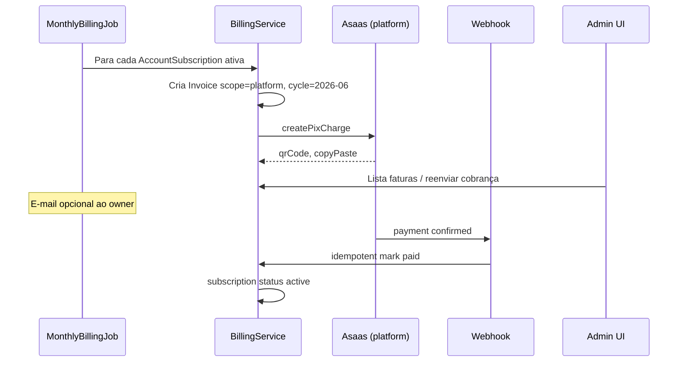

# Cobrança em duas camadas — Plataforma e Tenant

Este documento define como o **Cliente Manager** cobra em dois níveis usando o **mesmo mecanismo de domínio**, evitando dois sistemas de PIX/fatura/webhook separados.

| Camada | Quem paga | Quem recebe | Exemplo |
|--------|-----------|-------------|---------|
| **Plataforma (SaaS)** | Tenant (`account`) | Você (dono da plataforma) | R$ 49,90/mês pelo uso do app |
| **Tenant (revenda)** | Cliente final (`customer`) | Tenant (revendedor) | R$ 35,00/mês da assinatura IPTV |

---

## Princípio: um motor, dois escopos

```
packages/shared          → enums InvoiceStatus, BillingScope, DTOs Zod
apps/api/modules/billing → invoice, payment, webhooks (scope-aware)
apps/api/integrations/payment → PaymentProvider (Asaas, …)
```

Toda fatura tem:

| Campo | Plataforma | Tenant |
|-------|------------|--------|
| `scope` | `platform` | `tenant` |
| `accountId` | tenant cobrado | tenant credor |
| `customerId` | `null` | cliente cobrado |
| `amount` | valor do plano SaaS | valor do plano IPTV do cliente |
| `billingCycleKey` | `2026-06` | `2026-06` |
| `dueDate` | calculado por `due_day` da assinatura | `due_day` do cliente ou ciclo |
| `status` | draft → open → paid / overdue / canceled | idem |

**Pagamento** referencia `invoiceId`, guarda `providerPaymentId` (UNIQUE, P0.3), método `pix | manual`.

---

## Configuração PIX (duas contas PSP)

| Config | Onde | Quem paga taxa PSP |
|--------|------|---------------------|
| `platform_payment_config` | 1 registro global (env ou tabela) | Conta Asaas **sua** (plataforma) |
| `tenant_payment_config` | 1 por `accountId` | Conta Asaas **do revendedor** |

O adapter não muda — muda só **qual credencial** o factory carrega:

```typescript
// integrations/payment/payment-provider.factory.ts
getProvider({ scope, accountId }): PaymentProvider
```

Webhooks:

| Rota | Escopo |
|------|--------|
| `POST /api/webhooks/pix/platform` | Faturas `scope=platform` |
| `POST /api/webhooks/pix/:tenantSlug` | Faturas `scope=tenant` |

Ambos: idempotência por `provider_payment_id`, audit log, evento interno `PaymentConfirmed`.

---

## Modelo de dados (proposta Prisma)

### Plataforma (SaaS)

```prisma
model PlatformPlan {
  id          String   @id @default(uuid())
  name        String   // "Starter", "Pro"
  priceCents  Int      // 4990 = R$ 49,90
  billingCycle BillingCycle @default(monthly)
  maxCustomers Int?   // opcional: limite soft
  active      Boolean  @default(true)
}

model AccountSubscription {
  id          String   @id @default(uuid())
  accountId   String   @unique
  account     Account  @relation(...)
  platformPlanId String
  platformPlan PlatformPlan @relation(...)
  dueDay      Int      // 1-28
  status      SubscriptionStatus // active, past_due, canceled
  startedAt   DateTime @default(now())
}
```

### Faturas e pagamentos (unificados)

```prisma
enum BillingScope {
  platform
  tenant
}

enum InvoiceStatus {
  draft
  open
  paid
  overdue
  canceled
}

model Invoice {
  id               String        @id @default(uuid())
  scope            BillingScope
  accountId        String
  customerId       String?       // null se scope=platform
  billingCycleKey  String        // YYYY-MM
  amountCents      Int
  dueDate          DateTime
  status           InvoiceStatus @default(draft)
  pixCopyPaste     String?
  pixQrCode        String?
  providerChargeId String?       @unique
  paidAt           DateTime?
  createdAt        DateTime      @default(now())
  payments         Payment[]
  @@unique([scope, accountId, customerId, billingCycleKey])
}

model Payment {
  id                  String   @id @default(uuid())
  invoiceId           String
  invoice             Invoice  @relation(...)
  amountCents         Int
  method              String   // pix, manual
  providerPaymentId   String?  @unique
  paidAt              DateTime @default(now())
}
```

> O `@@unique` evita duas faturas do mesmo ciclo para o mesmo devedor.

---

## Fluxos

### A) Cobrança mensal SaaS (admin → tenant)



**Regras de negócio (decidir antes de codar):**

| # | Decisão | Sugestão default |
|---|---------|------------------|
| 1 | Preço SaaS | Plano fixo mensal por tenant (MVP); depois tier por qtd clientes |
| 2 | `due_day` | Dia 10 de cada mês (configurável na assinatura) |
| 3 | Inadimplência | Após N dias `overdue` → suspender `account.status` |
| 4 | Geração | Job cron dia 1 (ou D-3 do vencimento) |
| 5 | Pro-rata | Backlog: não no MVP |

### B) Cobrança tenant → cliente (igual spec Fase 1)

Mesmo `Invoice` com `scope=tenant` + `customerId`. Automação D-N (Fase 4) só enxerga faturas `scope=tenant`.

Após `PaymentConfirmed` (tenant scope) → evento → `renewals` cria `server_renewal_task`.

**Plataforma:** pagamento confirmado **não** cria renovação de servidor — apenas mantém tenant ativo.

---

## UI espelhada (mesmos padrões)

| Tela tenant (Fase 3) | Tela admin (Fase 2.5) |
|----------------------|------------------------|
| `/invoices` | `/admin/invoices` |
| `/payments` | `/admin/payments` |
| Detalhe cliente → aba pagamentos | Detalhe conta → aba faturas SaaS |
| Copiar PIX + toast (P0.5) | Idem |
| `PageLayout` + busca + paginação | Idem |

Componentes reutilizáveis em `shared/ui/billing/`:

- `InvoiceStatusBadge`
- `InvoiceCard` / lista
- `CopyPixButton`

---

## Módulos backend (estrutura)

```
apps/api/src/modules/billing/
├── index.ts
├── billing.routes.ts          # tenant routes (/api/invoices)
├── platform-billing.routes.ts # admin routes (/api/admin/invoices)
├── invoice.service.ts
├── payment.service.ts
└── billing.events.ts          # PaymentConfirmed

apps/api/src/integrations/payment/
├── payment-provider.interface.ts
├── asaas.provider.ts
└── payment-provider.factory.ts

apps/api/src/jobs/
└── platform-monthly-billing.job.ts
```

**Regra:** `customers` não importa `billing` diretamente — usar eventos ou chamadas via app orchestrator.

---

## Fases de entrega (recorte)

### Fase 2.5 — MVP plataforma (2–3 sprints)

1. Migrations `PlatformPlan`, `AccountSubscription`, `Invoice`, `Payment`
2. `PaymentProvider` + webhook platform
3. Admin: CRUD plano SaaS, assign plano à conta, listar faturas, botão “Gerar fatura do mês”
4. Job mensal + suspensão por inadimplência (configurável)
5. (Opcional) Tenant settings: “Assinatura Cliente Manager” read-only

### Fase 3 — MVP tenant

1. `tenant_payment_config` + webhook por slug
2. CRUD fatura manual + automática por cliente
3. Front `/invoices`, `/payments`, P1.6 aba no cliente

### Depois

- Fase 4: automação + WhatsApp (só `scope=tenant`)
- Fase 5: renewals

---

## Perguntas em aberto (fechar com produto)

1. **Preço SaaS:** valor único ou planos Starter/Pro?
2. **Cobrança por uso:** contar `customers` ativos e cobrar variável? (ex.: R$ base + R$ por cliente)
3. **Trial:** conta nova tem 7 dias sem fatura?
4. **Tenant vê fatura SaaS** no app dele ou só recebe e-mail/WhatsApp?
5. **Nota fiscal:** fora do escopo MVP (só controle interno + PIX)?

---

## Prompt Cursor (quando for implementar)

> Implemente Fase 2.5 conforme docs/iptv-manager/10-billing-dual-layer.md: migrations Invoice/Payment com BillingScope, módulo billing, Asaas platform config, webhook idempotente, rotas admin /api/admin/invoices, job mensal. Reutilize PageLayout, usePaginatedList e padrão PIX da doc 03. Não acople customers ao billing — use eventos.
