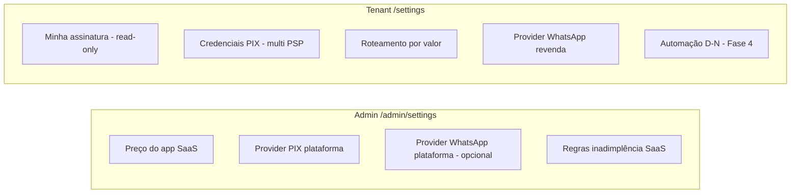
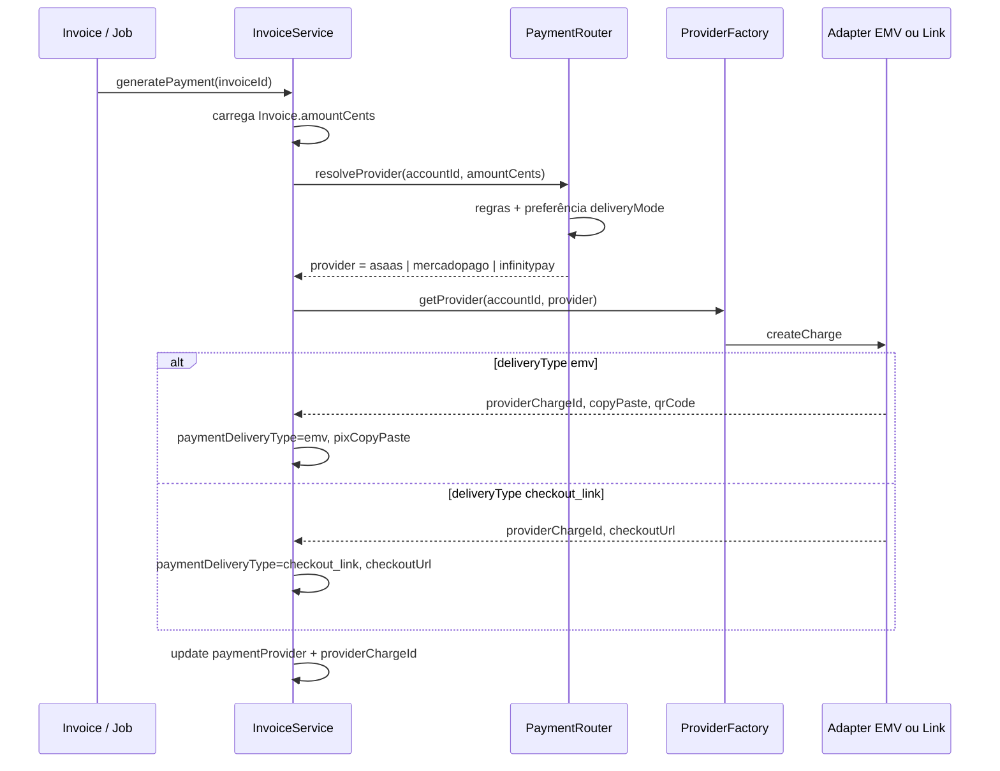
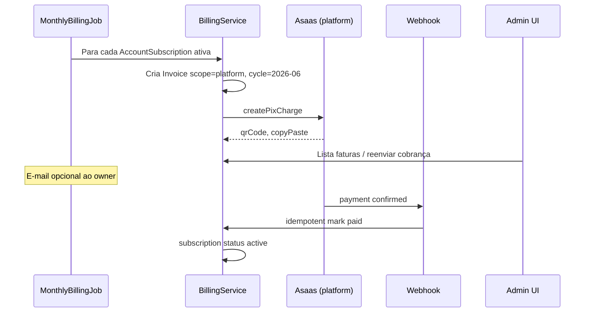

# Cobrança em duas camadas — Plataforma e Tenant

Este documento define como o **Cliente Manager** cobra em dois níveis usando o **mesmo mecanismo de domínio**, evitando dois sistemas de pagamento/fatura/webhook separados.

**Pagamento híbrido:** o mesmo motor suporta **PIX copia e cola (EMV)** e **link de checkout** (ex.: InfinitePay no WhatsApp). Detalhes de adapters e WhatsApp em [03-integrations-pix-whatsapp.md](./03-integrations-pix-whatsapp.md).

| Camada | Quem paga | Quem recebe | Exemplo |
|--------|-----------|-------------|---------|
| **Plataforma (SaaS)** | Tenant (`account`) | Você (dono da plataforma) | R$ 49,90/mês pelo uso do app |
| **Tenant (revenda)** | Cliente final (`customer`) | Tenant (revendedor) | R$ 35,00/mês da assinatura IPTV |

---

## Princípio: um motor, dois escopos

```
packages/shared          → enums InvoiceStatus, BillingScope, DTOs Zod
apps/api/modules/billing → invoice, payment, webhooks (scope-aware)
apps/api/integrations/payment → PaymentProvider (Asaas, …)
```

Toda fatura tem:

| Campo | Plataforma | Tenant |
|-------|------------|--------|
| `scope` | `platform` | `tenant` |
| `accountId` | tenant cobrado | tenant credor |
| `customerId` | `null` | cliente cobrado |
| `amount` | valor do **PlatformPlan** (admin em Configurações) | valor do **`Plan`** do cliente (`/plans`) |
| `billingCycleKey` | `2026-06` | `2026-06` |
| `dueDate` | calculado por `nextDueDate` da assinatura SaaS | `due_day` do cliente ou ciclo |
| `status` | draft → open → paid / overdue / canceled | idem |
| `paymentProvider` | PSP usado na cobrança (persistido ao gerar pagamento) | idem — **escolhido por roteamento de valor** |
| `paymentDeliveryType` | `emv` \| `checkout_link` — formato de entrega | idem — definido pelo adapter |
| `pixCopyPaste` / `checkoutUrl` | EMV ou link (mutuamente exclusivos por cobrança) | idem |

**Pagamento** referencia `invoiceId`, guarda `providerPaymentId` (UNIQUE, P0.3), método `pix | manual`.

**Endpoint:** `POST .../generate-payment` (alias legado `generate-pix`). Uma fatura = **uma cobrança ativa**; não gerar dois PSPs na mesma fatura.

---

## Configuração PIX (credenciais + roteamento por valor)

### Camadas de config

| Config | Onde | Quem paga taxa PSP |
|--------|------|---------------------|
| `platform_payment_config` | 1 registro global | Conta PSP **sua** (plataforma) |
| `tenant_payment_credentials` | N por `accountId` + `provider` | Contas PSP **do revendedor** (Asaas, Efi, Mercado Pago, …) |
| `tenant_payment_routing_rules` | N por `accountId`, ordenadas por `minAmountCents` | Define **qual PSP** usar conforme o valor da fatura |

> **Legado:** `tenant_payment_config` (1 provider por tenant) permanece até migração; novos fluxos usam credenciais múltiplas + regras.

### Por que roteamento por valor (não por cliente nem por plano)

| Decisão | Onde configurar | Motivo |
|---------|-----------------|--------|
| **Quanto cobrar** | `Plan.price`, fatura manual, ciclo anual | Preço do produto |
| **Qual PSP usar** | Regras por `amountCents` | Otimizar taxa (fixa vs percentual) |
| **Qual plano o cliente tem** | `Customer.planId` | Define o valor que entra na fatura |

**Caso típico:** mensalidade baixa (R$ 35) → PSP percentual (~R$ 0,70); pagamento anual alto (R$ 400+) → Asaas taxa fixa (R$ 1,99/cobrança).

O roteamento olha **`Invoice.amountCents` no momento de `generatePayment`**, não o cadastro do cliente. Plano anual entra indiretamente porque gera fatura com valor maior.

**Preferência de entrega (proposta):** além das regras por valor, o tenant pode configurar `deliveryMode` (`auto` \| `emv_only` \| `link_only` \| `emv_preferred`) para filtrar providers antes do router — ver doc 03.

### Regras de roteamento (tenant)

Regras avaliadas em ordem decrescente de `minAmountCents` (maior limiar primeiro). A primeira regra que satisfizer `amountCents >= minAmountCents` vence; se nenhuma bater, usa a regra com `minAmountCents = 0` (default).

Exemplo:

| minAmountCents | provider | Uso |
|----------------|----------|-----|
| `15000` (R$ 150) | `asaas` | Anuais, valores altos — taxa fixa |
| `0` | `mercadopago` | Mensalidades — taxa percentual |

```typescript
// integrations/payment/payment-router.service.ts
resolveProvider({ scope, accountId, amountCents }): PaymentProviderType

// integrations/payment/payment-provider.factory.ts
getProvider({ scope, accountId, provider }): PaymentProvider
```

**Invariantes:**

1. Ao gerar pagamento, gravar `Invoice.paymentProvider`, `paymentDeliveryType`, `providerChargeId` e campos EMV **ou** link — **nunca trocar PSP** depois que a cobrança existir no PSP.
2. Cancelamento/recriação de fatura usa o **mesmo** `paymentProvider` da fatura original (ou nova fatura passa pelo router de novo com novo `amountCents`).
3. Webhook reconcilia via `providerChargeId` (ou `order_nsu` mapeado, ex. InfinitePay) → invoice → adapter do `paymentProvider` persistido.
4. **Não** gerar Asaas + InfinitePay na mesma fatura — evita pagamento duplo e conciliação ambígua.

### Webhooks

| Rota | Escopo |
|------|--------|
| `POST /api/webhooks/payment/platform` | Faturas `scope=platform` |
| `POST /api/webhooks/payment/:tenantSlug/:provider` | Faturas `scope=tenant` — `:provider` valida origem |

> Alias legado: `/api/webhooks/pix/...` até migrar integrações.

Ambos: idempotência por `provider_payment_id`, audit log, evento interno `PaymentConfirmed`.

---

## Telas de configurações (admin e tenant)

**Mesma UX**, rotas e permissões diferentes. Um layout compartilhado (`SettingsLayout` / abas) com seções que aparecem conforme o **papel**.

| Rota | Quem acessa |
|------|-------------|
| `/admin/settings` | `platform_admin` |
| `/settings` | `account_user` (revendedor) |

### Onde entra o “preço” em cada mundo

| Conceito | Onde se define | Onde aparece |
|----------|---------------|--------------|
| **Preço do app (SaaS)** | **Admin** em Configurações (`PlatformPlan` / valor mensal da plataforma) | Tenant: **somente leitura** em Configurações → “Minha assinatura” |
| **Preço cobrado do cliente final** | **Tenant** em **Planos** (`/plans` — já existe `Plan.price`) | Faturas `scope=tenant` usam o plano vinculado ao `customer` |
| **Providers (PIX / WhatsApp)** | Cada lado configura credenciais PSP | Admin: 1 credencial plataforma · Tenant: **N credenciais** + **regras por valor** |
| **Roteamento PSP (taxa)** | Tenant em Configurações → Roteamento | Preview: “R$ 35 → Mercado Pago · R$ 420 → Asaas” |

Ou seja: na tela de configurações do **tenant não se edita o valor do Cliente Manager** — esse valor vem do **plano SaaS** que o admin atribuiu à conta. O tenant edita em **Planos** quanto cobra dos **clientes IPTV**.

### Seções da tela (por papel)



| Seção | Admin | Tenant |
|-------|-------|--------|
| **Preço / plano SaaS** | Editar valor mensal (ou planos Starter/Pro), `due_day` default, trial | Exibir: “Você paga R$ X/mês — Plano Y”, próximo vencimento, link copiar PIX da fatura SaaS |
| **PIX — credenciais** | Select provider + API key + webhook secret (mascarado) | **Lista** de PSPs configurados (`tenant_payment_credentials`) |
| **PIX — roteamento** | Opcional (plataforma com 1 PSP) | Limiares em R$ → provider; simulador; preferência EMV/link (futuro) |
| **WhatsApp — provider** | Opcional (avisos plataforma) | `evolution` \| `meta` + URL/token instância |
| **Automação** | — | Dias antes do vencimento, horário, template (Fase 4) |
| **Equipe** | — | `account_user` convites (backlog) |

### Backend

| Escopo | API |
|--------|-----|
| Plataforma | `GET/PATCH /api/admin/platform-settings` (preço, provider, credenciais criptografadas) |
| Contas (admin) | `POST/PATCH /api/admin/tenants` — criar/editar conta com `dueDate`; inclui `AccountSubscription` |
| Fatura SaaS manual | `POST /api/admin/tenants/:id/invoices` — gera fatura `scope=platform` no `nextDueDate` e avança +1 mês |
| Tenant | `GET/PATCH /api/settings` (whatsapp, automation) |
| Tenant (credenciais PIX) | `GET/PUT /api/settings/payment-credentials` — CRUD por `provider` |
| Tenant (roteamento) | `GET/PUT /api/settings/payment-routing` — regras `minAmountCents` → `provider` |
| Tenant (assinatura) | `GET /api/settings/subscription` — read-only: plano SaaS, valor, status, próxima fatura |

**Segurança:** API keys nunca retornam em claro após salvar (só `••••` + botão “substituir”). Secrets no banco criptografados (coluna ou app-level).

### Frontend (reuso)

```
features/settings/
├── pages/SettingsPage.tsx       # detecta admin vs tenant (prop ou rota)
├── sections/
│   ├── PlatformPricingSection.tsx   # só admin
│   ├── MySubscriptionSection.tsx    # só tenant (read-only)
│   ├── PaymentCredentialsSection.tsx   # lista de PSPs + API keys (tenant multi; admin single)
│   ├── PaymentRoutingSection.tsx       # só tenant — limiares por valor
│   └── WhatsAppProviderSection.tsx
└── api/settings.api.ts
```

Admin registra rota em `App.tsx` sob `AdminShell`; tenant sob `AppShell` — **mesmos componentes**, `variant: 'platform' | 'tenant'`.

### Providers disponíveis (select na UI)

**Pagamento:**

| Valor | Label | Entrega | MVP |
|-------|-------|---------|-----|
| `asaas` | Asaas | `emv` | ✅ 1º adapter real |
| `mercadopago` | Mercado Pago | `emv` | ✅ 2º adapter |
| `efi` | Efi (Gerencianet) | `emv` | futuro |
| `pushinpay` | PushinPay | `emv` (+ split opcional) | futuro |
| `infinitypay` | InfinitePay | `checkout_link` | futuro |

**Credenciais por provider:**

| Provider | Campo principal | Observação |
|----------|-----------------|------------|
| Asaas, MP, Efi, PushinPay | `apiKey` | Bearer ou API key conforme PSP |
| InfinitePay | `handle` (InfiniteTag) | Sem `$`; link de checkout, não EMV inline |

**WhatsApp:**

| Valor | Label | MVP |
|-------|-------|-----|
| `evolution` | Evolution API | ✅ Fase 4 |
| `meta` | WhatsApp Business API | futuro |

Na geração do pagamento, o **router** escolhe o `provider`; o **factory** carrega credencial e instancia o adapter (EMV ou link).

---

## Roteamento de PSP por valor — detalhe

### Fluxo na geração do pagamento (híbrido)



### Matemática de taxa (referência para UI)

| PSP | Entrega | Modelo típico | Melhor para |
|-----|---------|---------------|-------------|
| Asaas | EMV | ~R$ 1,99 fixo/cobrança PIX | Valores **altos** (anual, pacotes) |
| Mercado Pago / Efi / PushinPay | EMV | ~% + fixo pequeno | Valores **baixos** (mensalidade) |
| InfinitePay | Link | PIX taxa zero na conta InfinitePay | Revenda que prefere **link no Zap** |

Ponto de equilíbrio EMV fixo vs percentual (exemplo com 2%): `1,99 / 0,02 ≈ R$ 99,50` — acima disso, taxa fixa tende a ganhar. InfinitePay entra por **preferência de UX/taxa**, não só por limiar — configurável via `deliveryMode` ou regra dedicada.

### O que **não** fazer

| Abordagem | Por quê evitar |
|-----------|----------------|
| Provider por `Customer` | Mesmo cliente pode ter mensal barato e cobrança anual alta |
| Provider fixo por `Plan` | Promoção, conexão extra e fatura manual mudam `amountCents` |
| Trocar PSP após pagamento gerado | Quebra `providerChargeId` e webhook |
| Dois PSPs na mesma fatura | Risco de pagamento duplo e conciliação confusa |

### Plano anual e valor da fatura

| Opção | Comportamento |
|-------|---------------|
| `Plan.billingCycle = yearly` | Job/fatura usa `price × 12` ou campo `yearlyPriceCents` dedicado |
| Fatura manual | `amountCents` informado na criação — router aplica na hora |

Em todos os casos, a decisão de PSP é sempre **`amountCents` da fatura**, não o plano em si.

---

## Modelo de dados (proposta Prisma)

### Plataforma (SaaS)

```prisma
model PlatformPlan {
  id          String   @id @default(uuid())
  name        String   // "Starter", "Pro"
  priceCents  Int      // 4990 = R$ 49,90
  billingCycle BillingCycle @default(monthly)
  maxCustomers Int?   // opcional: limite soft
  active      Boolean  @default(true)
}

model AccountSubscription {
  id          String   @id @default(uuid())
  accountId   String   @unique
  account     Account  @relation(...)
  platformPlanId String
  platformPlan PlatformPlan @relation(...)
  dueDay      Int      // 1-28 — dia recorrente derivado de nextDueDate
  nextDueDate DateTime // próxima data de vencimento SaaS (fatura platform)
  status      SubscriptionStatus // active, past_due, canceled
  startedAt   DateTime @default(now())
}
```

### Faturas e pagamentos (unificados)

```prisma
enum BillingScope {
  platform
  tenant
}

enum InvoiceStatus {
  draft
  open
  paid
  overdue
  canceled
}

enum PaymentDeliveryType {
  emv
  checkout_link
}

model TenantPaymentCredential {
  id           String              @id @default(uuid())
  accountId    String
  provider     PaymentProviderType
  apiKey       String?             // criptografada
  webhookToken String?
  active       Boolean             @default(true)
  updatedAt    DateTime            @updatedAt

  @@unique([accountId, provider])
}

model TenantPaymentRoutingRule {
  id             String              @id @default(uuid())
  accountId      String
  minAmountCents Int                 // avaliar DESC; 0 = fallback
  provider       PaymentProviderType
  sortOrder      Int                 @default(0)
  active         Boolean             @default(true)

  @@index([accountId, minAmountCents])
}

// Proposta — preferência híbrida por tenant
model TenantPaymentPreference {
  id           String   @id @default(uuid())
  accountId    String   @unique
  deliveryMode String   @default("auto") // auto | emv_only | link_only | emv_preferred
  updatedAt    DateTime @updatedAt
}

model Invoice {
  id                   String                @id @default(uuid())
  scope                BillingScope
  accountId            String
  customerId           String?               // null se scope=platform
  billingCycleKey      String                // YYYY-MM
  amountCents          Int
  dueDate              DateTime
  status               InvoiceStatus         @default(draft)
  paymentProvider      PaymentProviderType?  // setado ao gerar pagamento; usado no webhook
  paymentDeliveryType  PaymentDeliveryType?  // emv | checkout_link
  pixCopyPaste         String?
  pixQrCode            String?
  checkoutUrl          String?
  providerChargeId     String?               @unique
  paidAt           DateTime?
  createdAt        DateTime            @default(now())
  payments         Payment[]
  @@unique([scope, accountId, customerId, billingCycleKey])
}

model Payment {
  id                  String   @id @default(uuid())
  invoiceId           String
  invoice             Invoice  @relation(...)
  amountCents         Int
  method              String   // pix, manual
  providerPaymentId   String?  @unique
  paidAt              DateTime @default(now())
}
```

> O `@@unique` evita duas faturas do mesmo ciclo para o mesmo devedor.

---

## Fluxos

### A) Cobrança mensal SaaS (admin → tenant)



**Regras de negócio (decidir antes de codar):**

| # | Decisão | Sugestão default |
|---|---------|------------------|
| 1 | Preço SaaS | Plano fixo mensal por tenant (MVP); depois tier por qtd clientes |
| 2 | Vencimento SaaS | `AccountSubscription.nextDueDate` definido ao criar/editar conta no admin |
| 3 | `dueDay` | Derivado de `nextDueDate` (cap 28) para ciclos mensais recorrentes |
| 4 | Geração de fatura | Manual: `POST /api/admin/tenants/:id/invoices` no vencimento; depois job cron |
| 5 | Após gerar fatura | Avançar `nextDueDate` +1 mês; bloquear duplicata no mesmo `billingCycleKey` |
| 6 | Inadimplência | Após N dias `overdue` → suspender `account.status` |
| 7 | Pro-rata | Backlog: não no MVP |

### B) Cobrança tenant → cliente (igual spec Fase 1)

Mesmo `Invoice` com `scope=tenant` + `customerId`. Automação D-N (Fase 4) só enxerga faturas `scope=tenant`.

Ao gerar pagamento:

1. `amountCents` vem do plano do cliente, ciclo anual ou fatura manual.
2. `PaymentRouter` escolhe PSP (ex.: R$ 35 → Mercado Pago EMV; R$ 420 → Asaas; tenant link-only → InfinitePay).
3. Fatura exibe badge do provider e ações conforme `paymentDeliveryType` (`/invoices/:id`).

Após `PaymentConfirmed` (tenant scope) → evento → `renewals` cria `server_renewal_task`.

**Plataforma:** pagamento confirmado **não** cria renovação de servidor — apenas mantém tenant ativo.

---

## UI espelhada (mesmos padrões)

| Tela tenant (Fase 3) | Tela admin (Fase 2.5) |
|----------------------|------------------------|
| `/invoices` | `/admin/invoices` |
| `/payments` | `/admin/payments` |
| Detalhe cliente → aba pagamentos | Detalhe conta → aba faturas SaaS |
| Copiar PIX / link + toast (P0.5) | Idem |
| `PageLayout` + busca + paginação | Idem |

Componentes reutilizáveis em `shared/ui/billing/`:

- `InvoiceStatusBadge`
- `InvoiceCard` / lista
- `CopyPixButton` — quando `paymentDeliveryType = emv`
- `PaymentLinkActions` — abrir/copiar link quando `checkout_link`
- `PaymentDeliveryBadge` — “PIX copia e cola” vs “Link de pagamento”

---

## Módulos backend (estrutura)

```
apps/api/src/modules/billing/
├── index.ts
├── billing.routes.ts          # tenant routes (/api/invoices)
├── platform-billing.routes.ts # admin routes (/api/admin/invoices)
├── invoice.service.ts
├── payment.service.ts
└── billing.events.ts          # PaymentConfirmed

apps/api/src/integrations/payment/
├── payment-provider.interface.ts
├── asaas.provider.ts
├── mercadopago.provider.ts
├── efi.provider.ts             # futuro
├── pushinpay.provider.ts         # futuro — emv
├── infinitypay.provider.ts       # futuro — checkout_link
├── payment-router.service.ts
├── payment-message.util.ts       # bloco WhatsApp / payment_block
├── payment-fee.util.ts
└── payment-provider.factory.ts

apps/api/src/jobs/
└── platform-monthly-billing.job.ts
```

**Regra:** `customers` não importa `billing` diretamente — usar eventos ou chamadas via app orchestrator.

---

## Fases de entrega (recorte)

### Fase 2.5 — MVP plataforma (2–3 sprints)

1. Migrations `PlatformPlan`, `PlatformPaymentConfig`, `AccountSubscription`, `Invoice`, `Payment`
2. `PaymentProvider` + webhook platform
3. **`/admin/settings`** — preço SaaS + provider PIX plataforma
4. **`/settings`** (tenant) — provider PIX revenda + seção **Minha assinatura** (preço SaaS read-only)
5. Admin: assign plano à conta, listar faturas, botão “Gerar fatura do mês”
6. Job mensal + suspensão por inadimplência (configurável)

### Fase 3 — MVP tenant

1. Migration: `tenant_payment_credentials`, `tenant_payment_routing_rules`, `Invoice.paymentProvider`
2. Migrar dados de `tenant_payment_config` → credenciais (compatibilidade)
3. `PaymentRouter` + factory multi-PSP + webhook por slug **e** provider
4. CRUD fatura manual + automática por cliente (router na geração de pagamento)
5. **`/settings`**: credenciais multi-PSP + editor de roteamento por valor
6. Front `/invoices`, `/payments` — badge PSP no detalhe; P1.6 aba no cliente

### Fase 3.1 — Pagamento híbrido (EMV + link)

1. Migration: `PaymentDeliveryType`, `Invoice.checkoutUrl`, `Invoice.paymentDeliveryType`
2. Contrato `PaymentProvider.createCharge` + `generatePayment` (alias `generate-pix`)
3. Adapters EMV reais (Asaas + Mercado Pago) + webhooks idempotentes
4. Adapter InfinitePay (`checkout_link`) + credencial `handle`
5. `payment-message.util` + template WhatsApp `{{payment_block}}`
6. UI: ações condicionais (copiar PIX vs abrir/copiar link)
7. Opcional: PushinPay como provider EMV adicional

### Depois

- Fase 4: automação + WhatsApp com `payment_block` (só `scope=tenant`)
- Fase 5: renewals

---

## Perguntas em aberto (fechar com produto)

1. **Preço SaaS:** um único valor em Configurações admin ou vários `PlatformPlan` (Starter/Pro)?
2. **Cobrança por uso:** contar `customers` ativos e cobrar variável? (ex.: R$ base + R$ por cliente)
3. **Trial:** conta nova tem 7 dias sem fatura?
4. **Tenant vê fatura SaaS** no app dele ou só recebe e-mail/WhatsApp?
5. **Nota fiscal:** fora do escopo MVP (só controle interno + PIX)?
6. **Limiar default de roteamento:** ex. R$ 150 configurável; seed inicial por tenant?
7. **Segundo PSP (percentual):** Mercado Pago ou Efi primeiro no MVP tenant?
8. **Plataforma (SaaS):** roteamento multi-PSP só no tenant ou também admin → tenant?
9. **Plano anual:** `yearlyPriceCents` no `Plan` ou `price × 12` automático?
10. **Híbrido:** InfinitePay entra no router por valor ou só via `link_only` / preferência tenant?
11. **PushinPay:** provider no enum antes ou depois dos adapters EMV principais?
12. **WhatsApp:** manter `{{pix}}` legado ou só `{{payment_block}}` na Fase 4?

---

## Prompt Cursor (quando for implementar)

> Implemente Fase 3.1 conforme docs/iptv-manager/10-billing-dual-layer.md e 03-integrations-pix-whatsapp.md: contrato híbrido `PaymentProvider.createCharge`; migrations `paymentDeliveryType`, `checkoutUrl`; adapters EMV (Asaas + Mercado Pago) + InfinitePay (link); webhooks `POST /api/webhooks/payment/...` idempotentes; `generatePayment` substituindo stub; WhatsApp `{{payment_block}}`; UI condicional EMV vs link. Não acople customers ao billing — use eventos.
