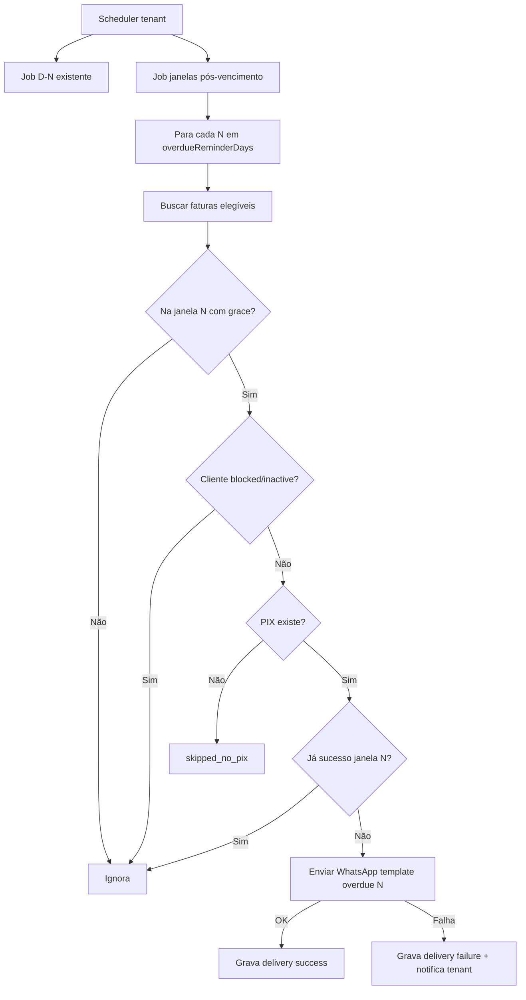

# Feature 19 — Lembretes pós-vencimento (janelas D+N) + bloqueio

**Status:** 📋 Especificação fechada (aguardando implementação)  
**Prioridade:** Alta (cobrança / retenção)  
**Última revisão:** 12/06/2026  

Relacionado: [12-billing-automation-scheduler.md](./12-billing-automation-scheduler.md) · [11-payment-and-activations.md](./11-payment-and-activations.md) · [15-billing-automation-observability.md](./15-billing-automation-observability.md) · [16-whatsapp-payment-notification-and-templates.md](./16-whatsapp-payment-notification-and-templates.md)

---

## Objetivo

Complementar a automação **D-N** (pré-vencimento) com **lembretes pós-vencimento** em **janelas fixas** configuráveis (ex.: 1, 7 e 15 dias após o vencimento), **sem criar fatura nem gerar PIX** — apenas reenvio da notificação WhatsApp usando o PIX já existente.

O tenant controla **quando parar de cobrar** bloqueando o cliente manualmente.

---

## Decisões de produto (fechadas)

| # | Decisão |
|---|---------|
| 1 | Janelas definidas na **tela Configurações → Automação** |
| 2 | Default das janelas: **`1, 7, 15`** (dias após o vencimento) |
| 3 | Cada janela envia **no máximo 1 mensagem bem-sucedida** por fatura/ciclo |
| 4 | **Não** cria fatura nem regenera PIX no D+N — só notificação |
| 5 | Cliente **`blocked`** não recebe **nenhuma** cobrança automática, **incluindo a inicial D-N** |
| 6 | **Bloqueio é decisão do tenant** (ação manual na UI); sem auto-bloqueio no MVP |
| 7 | Em caso de **falha de envio**, **pode reenviar** até obter sucesso naquela janela |
| 8 | Falhas devem **notificar o tenant** (WhatsApp e/ou relatório do job) com **motivo legível** |

---

## Contexto — o que já existe

| Item | Hoje |
|------|------|
| D-N | Cria fatura (se não existir), gera PIX (opcional), envia WhatsApp **uma vez** com sucesso |
| Pós-vencimento | Nenhum lembrete automático |
| `invoice_charge_deliveries` | Auditoria por fatura; `source`: `manual` \| `automation` |
| D-N filtra clientes | `status: 'active'` apenas → `blocked` e `inactive` já ficam de fora |
| Relatório pós-run | WhatsApp para o tenant com resumo das cobranças D-N enviadas |

---

## Modelo de janelas

### Definição

Lista ordenada de inteiros **≥ 1**: dias de calendário **após** `dueDate` da fatura em que um lembrete **pode** ser enviado.

**Default:** `[1, 7, 15]`

**Exemplo** (vencimento 10/06):

| Janela | Dia do lembrete | Máx. mensagens |
|--------|-----------------|----------------|
| D+1 | 11/06 | 1 (se sucesso) |
| D+7 | 17/06 | 1 (se sucesso) |
| D+15 | 25/06 | 1 (se sucesso) |

Total máximo por fatura/ciclo: **3 mensagens** (com default), em dias distintos — **sem spam diário**.

### Elegibilidade (por fatura, por janela `N`)

Todas devem ser verdadeiras:

1. `kind = subscription`
2. `status IN (open, overdue)`
3. `pixCopyPaste IS NOT NULL` (PIX já gerado no D-N ou manual)
4. `customer.status = active` (não `blocked`, não `inactive`)
5. `customer.phone` válido (E.164)
6. **Calendário (fuso tenant, default `America/Sao_Paulo`):** `hoje >= dueDate + N dias`
7. **Grace de falha (ver abaixo):** ainda dentro do período de retentativa da janela `N`
8. **Não existe** `invoice_charge_deliveries` com `source = automation_overdue`, `windowDaysAfterDue = N`, `success = true`

Se **não houver PIX** → não envia; registra `skipped_no_pix` no run.

---

## Anti-spam e retentativa

### Uma mensagem por janela (sucesso)

Idempotência **somente em envio bem-sucedido**:

- `success = true` para `(invoiceId, automation_overdue, windowDaysAfterDue=N)` → **não reenvia** aquela janela.
- `success = false` → **pode reenviar** no próximo tick do scheduler.

### Grace de falha / janela perdida

Para não perder lembrete por falha transitória (WhatsApp, timeout):

| Parâmetro | Default | Descrição |
|-----------|---------|-----------|
| `overdueReminderFailureGraceDays` | `1` | Após o dia `dueDate + N`, ainda tenta reenviar por mais N dias **se nunca houve sucesso** naquela janela |

Exemplo janela D+1 (venceu dia 10):

- Dia 11: tenta enviar (dia ideal)
- Falhou → dias 12 (grace) ainda retenta
- Dia 13+: **não** retenta D+1 (passou grace); aguarda próxima janela (D+7)

**Não** reenvia indefinidamente: só até sucesso ou fim do grace.

---

## Bloqueio do cliente

| Status | D-N (cobrança inicial) | Janelas D+1 / D+7 / D+15 | Cobrança manual |
|--------|------------------------|---------------------------|-----------------|
| `active` | Sim (se na janela D-N) | Sim (se na janela e elegível) | Sim |
| `blocked` | **Não** | **Não** | Produto: permitir manual com aviso (fora do escopo automação) |
| `inactive` | Não | Não | Não |

**Bloqueio = decisão do tenant** (botão na ficha/lista de clientes). Não há auto-bloqueio nesta feature.

Texto sugerido na UI de automação:

> “Após os lembretes configurados, bloqueie o cliente para interromper qualquer cobrança automática.”

---

## Fluxo do job



---

## Envio (somente notificação)

Novo modo no serviço de cobrança (conceitual):

`sendOverdueReminderViaWhatsApp(invoiceId, windowDaysAfterDue)`

- **Não** chama `create invoice`
- **Não** chama `generatePayment`
- Usa `pixCopyPaste` já gravado na fatura
- Template por janela (ou genérico + `{{dias_atraso}}`)
- Grava `invoice_charge_deliveries`:
  - `source = automation_overdue`
  - `windowDaysAfterDue = N` (campo novo)
  - `success` / `errorMessage`

### Templates (aba Cobrança)

Sugestão de chaves:

| Janela | Chave config | Tom |
|--------|--------------|-----|
| D+1 | `subscriptionOverdueDay1` | Lembrete amigável |
| D+7 | `subscriptionOverdueDay7` | Cobrança em atraso |
| D+15 | `subscriptionOverdueDay15` | Último aviso antes de bloqueio |

Placeholders: `{{nome}}`, `{{valor}}`, `{{vencimento}}`, `{{dias_atraso}}`, `{{pix}}`, `{{payment_block}}` (futuro).

Fallback: template genérico `subscriptionOverdue` + `{{dias_atraso}} = N`.

---

## Configuração na UI (tenant)

**Configurações → Automação → Pós-vencimento**

| Campo | Tipo | Default |
|-------|------|---------|
| Lembretes pós-vencimento ativos | boolean | `false` |
| Dias após vencimento (janelas) | lista de inteiros | `1, 7, 15` |
| Dias de grace após falha | int | `1` |
| Enviar WhatsApp | boolean | herda `sendWhatsapp` global |

Validação:

- Lista não vazia se ativo
- Valores inteiros ≥ 1, sem duplicatas, ordenados
- Máximo sugerido: **5 janelas** (evitar abuso)

Editor de janelas: chips ou lista editável (`1`, `7`, `15` pré-preenchidos).

---

## Notificação ao tenant em falhas

Além do relatório agregado pós-run (como D-N):

### No relatório do run

Incluir seção:

```text
Lembretes pós-vencimento:
  Enviados: D+1: 2 | D+7: 1 | D+15: 0
  Falhas: 1
  - João Silva (D+7): WhatsApp não conectado
  - Maria (D+1): Telefone inválido
  Ignorados: bloqueado: 2 | sem PIX: 1
```

### Falha imediata (opcional v1.1)

WhatsApp ao tenant quando falha crítica repetida (ex.: `WHATSAPP_NOT_CONNECTED`) — reutilizar padrão de erros da Feature 13.

Códigos esperados (exemplos): `WHATSAPP_NOT_CONNECTED`, `MISSING_PHONE`, `MISSING_PIX`, `INVOICE_NOT_PAYABLE`.

---

## Modelo de dados (alterações previstas)

### `TenantBillingAutomationConfig`

| Campo novo | Tipo | Default |
|------------|------|---------|
| `overdueRemindersEnabled` | boolean | `false` |
| `overdueReminderDays` | int[] | `[1, 7, 15]` |
| `overdueReminderFailureGraceDays` | int | `1` |

### `InvoiceChargeDelivery`

| Campo novo | Tipo |
|------------|------|
| `windowDaysAfterDue` | int? (null para D-N / manual) |

Índice único sugerido (sucesso):

`(invoiceId, source, windowDaysAfterDue)` WHERE `source = 'automation_overdue' AND success = true`

### `BillingJobRun.summary` (JSON)

Campos adicionais:

- `overdueRemindersSent`
- `overdueRemindersFailed`
- `overdueRemindersSkipped`
- `overdueReminderErrors[]` (cliente, janela, motivo)

---

## API (prevista)

Estender `GET/PATCH /api/settings/billing-automation`:

```typescript
overdueReminders: {
  enabled: boolean;
  daysAfterDue: number[];      // default [1, 7, 15]
  failureGraceDays: number;    // default 1
}
```

---

## Critérios de aceite

- [ ] Tenant configura janelas `1, 7, 15` (editável) na aba Automação.
- [ ] Com automação ativa, cliente vencido recebe no máximo **1 WhatsApp por janela** (3 no default).
- [ ] Lembrete usa **PIX existente**; sem PIX → skip + motivo no relatório.
- [ ] Cliente **bloqueado** não entra em D-N nem em D+N.
- [ ] Falha de envio → retenta dentro do grace; tenant vê falha e motivo no relatório.
- [ ] Sucesso na janela N → nunca reenvia N para a mesma fatura.
- [ ] Pagamento entre janelas → fatura `paid` → janelas futuras ignoradas.
- [ ] Testes unitários: elegibilidade por janela, idempotência, skip blocked, grace de falha.

---

## Fora de escopo (MVP)

- Auto-bloqueio por dias de atraso
- Lembretes para faturas `one_off`
- Regenerar PIX no D+N
- SMS / e-mail

---

## Plano de implementação (orientativo)

| PR | Entrega | Estimativa |
|----|---------|------------|
| **PR1** | Schema + config API/UI (janelas default 1,7,15) | 0,5 d |
| **PR2** | `OverdueReminderService` + integração scheduler | 1 d |
| **PR3** | Templates + `invoice_charge_deliveries.windowDaysAfterDue` | 0,5 d |
| **PR4** | Relatório tenant + falhas + testes | 1 d |

**Total:** ~3 dias.

---

## Smoke test pós-implementação

1. Cliente ativo, D-N rodou, PIX gerado, venceu ontem → recebe lembrete D+1.
2. Mesmo cliente no D+2 → **não** recebe outro D+1.
3. No D+7 → recebe segundo lembrete.
4. Bloquear cliente → nenhum lembrete seguinte.
5. Simular falha WhatsApp → retenta no grace; tenant vê erro no relatório.
6. Pagar fatura → D+15 não envia.

---

## Referência — arquivos a tocar (implementação futura)

| Área | Arquivos |
|------|----------|
| Doc | este arquivo |
| Prisma | `TenantBillingAutomationConfig`, `InvoiceChargeDelivery` |
| API | `billing-automation.service.ts`, `invoice-charge.service.ts`, `tenant-billing-automation.service.ts` |
| Web | aba Automação em `TenantSettingsPage`, templates em Cobrança |
| Shared | schemas Zod, tipos de relatório |
