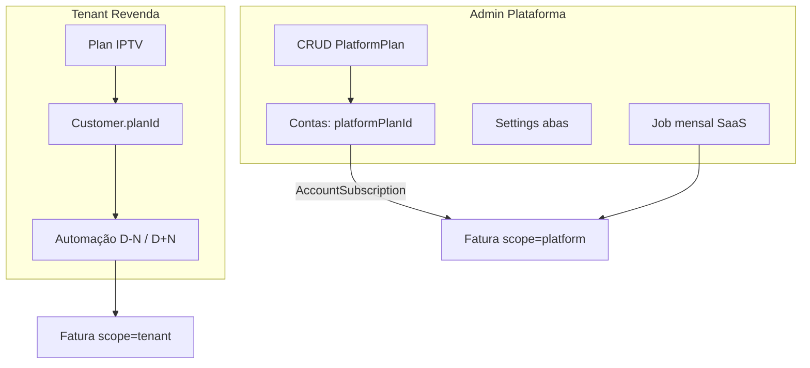

# Roadmap — Automação tenant (pendências) + Admin planos SaaS e settings

**Status:** ✅ Implementado (revisão 13/06/2026)  
**Última revisão:** 13/06/2026  
**Contexto:** pós-release v2.1.0.0 (Feature 19)

Relacionado: [14-admin-panel-overhaul.md](./14-admin-panel-overhaul.md) · [15-billing-automation-observability.md](./15-billing-automation-observability.md) · [17-saas-monthly-invoice-job.md](./17-saas-monthly-invoice-job.md) · [IMPLEMENTATION_STATUS.md](./IMPLEMENTATION_STATUS.md)

---

## Resumo

Duas frentes de trabalho:

1. **Frente A** — Fechar pendências da automação de cobrança **tenant** (IPTV → cliente final).
2. **Frente B** — Admin: **planos SaaS por tenant** + **configurações em abas** (espelhando `/settings` do tenant) + job mensal SaaS.

---

## O que já existe no banco (reaproveitar)

| Conceito tenant (revenda IPTV) | Equivalente admin (SaaS) | Status hoje |
|-------------------------------|--------------------------|-------------|
| `Plan` — vários planos | `PlatformPlan` — **já existe** | Só 1 plano default em Configurações |
| `Customer.planId` | `AccountSubscription.platformPlanId` | Vínculo já existe |
| Valor da fatura | `subscription.platformPlan.priceCents` | Usado ao gerar fatura SaaS |
| `/settings` com abas | `/admin/settings` página única | Admin não espelha tenant |

**Não é necessário criar tabela de planos SaaS do zero** — falta CRUD de `PlatformPlan`, seleção na conta e settings admin em abas.

---

## Frente A — Pendências automação tenant (cobrança IPTV)

Itens **encerrados ou fora de escopo** (13/06/2026):

| Item | Decisão |
|------|---------|
| Observabilidade na UI tenant (last-run, preview, erros) | 🚫 Fora de escopo — ver Feature 15 |
| BullMQ / Redis | 🚫 Fora de escopo — `node-cron` suficiente |
| Último run global no admin | 🚫 Fora de escopo |
| Aviso dev vs prod no scheduler (UI) | 🚫 Fora de escopo |
| Faturas no detalhe do cliente | ✅ `CustomerInvoicesSection` |
| Dry-run / preview na UI | 🚫 Fora de escopo |

**Estimativa restante desta frente:** 0 dias (épico fechado para o escopo atual).

---

## Frente B — Admin: planos SaaS + settings espelhando tenant

### B1 — CRUD `PlatformPlan`

**Objetivo:** cobrar valores diferentes por tenant (revenda).

| Entrega | Detalhe |
|---------|---------|
| `/admin/plans` | CRUD (espelho de `/plans` do tenant) |
| Contas | Combo “Plano SaaS” ao criar/editar |
| Fatura SaaS | `amountCents` = plano da assinatura (API já suporta) |
| Dashboard MRR | Somar preços reais das assinaturas, não `default × count` |

**API sugerida:**

- `GET/POST/PATCH/DELETE /admin/platform-plans`
- `PATCH /admin/tenants/:id` com `platformPlanId`, `dueDay`, `nextDueDate`

**Regras:**

- Um plano `isDefault` para novos tenants
- Não apagar plano com assinaturas ativas (soft-delete `active: false`)
- Troca de plano: próxima fatura usa novo valor; faturas `open` mantêm valor antigo (recomendado)

**Estimativa:** ~2 dias.

### B2 — Configurações admin em abas

| Aba tenant | Aba admin |
|------------|-----------|
| Geral | Plano padrão, link planos, dias suspensão |
| Pagamentos | PIX Mercado Pago plataforma |
| WhatsApp | Evolution/Meta plataforma |
| Cobrança | Templates mensagem SaaS → tenant (novo) |
| Automação | Job mensal faturas SaaS (Feature 17) — **não** D-N IPTV |

**Nota:** automação D-N/D+N IPTV é **só tenant**. No admin, “Automação” = cobrança SaaS automática:

- Gerar fatura `scope=platform` por `billingCycleKey`
- Opcional: WhatsApp ao tenant com PIX
- Suspensão após `overdueDays` sem pagamento

**Estimativa:** ~4–5 dias.

### B3 — Overhaul admin (Feature 14)

- Telefone da conta no formulário
- Filtros faturas SaaS (canceladas encontráveis)
- `getApiErrorMessage` em todas mutations admin
- Badges saúde (MP sem token, etc.)

**Estimativa:** ~3–4 dias.

---

## Arquitetura

---

## Ordem sugerida

| Fase | Entrega | Dias |
|------|---------|------|
| 1 | CRUD `PlatformPlan` + plano na conta + fix MRR | 2 |
| 2 | Admin settings em abas (Geral, Pagamentos, WhatsApp) | 1,5 |
| 3 | Fechar Feature 15 tenant | 2 |
| 4 | Templates SaaS + job mensal (Feature 17) | 3 |
| 5 | Polish Feature 14 | 2 |

**Total:** ~10–11 dias.

---

## Decisões de produto (fechadas — 13/06/2026)

1. **Planos SaaS:** somente **mensal** (`billingCycle = monthly` na API/UI; trimestral/anual não disponíveis).
2. **Troca de plano:** faturas **já criadas não alteram** valor (`amountCents` fixo na emissão); só próximas faturas usam o novo plano.
3. **Automação admin:** fluxo **completo** quando ativa — gerar fatura → gerar PIX → enviar WhatsApp ao tenant (telefone da conta). Configuração centralizada no único painel admin.
4. **Ordem de implementação (Frente A vs B1):** irrelevante — ambas entregues no mesmo épico.

---

## Critérios de aceite (épico)

- [x] Admin cria planos SaaS com preços distintos (somente mensais)
- [x] Conta nova/editada vincula `platformPlanId`
- [x] Fatura SaaS usa preço do plano da assinatura
- [x] MRR dashboard reflete soma real
- [x] `/admin/settings` com abas equivalentes ao tenant (escopo plataforma)
- [x] Pendências Feature 15 tenant fechadas
- [x] Job mensal SaaS com fluxo completo (fatura + PIX + WhatsApp)
