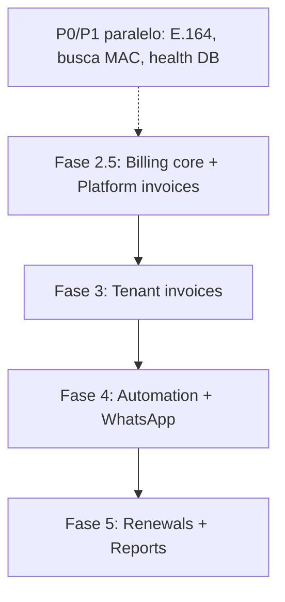

# Status da Implementação — Cliente Manager

Documento vivo: última atualização após alinhamento do roadmap (Fase 2.5 nos guias 00, 01, 02, 09).

Relacionado: [10-billing-dual-layer.md](./10-billing-dual-layer.md) · [09-improvements-p0-p1.md](./09-improvements-p0-p1.md)

---

## Resumo executivo

| Fase | Escopo | Status |
|------|--------|--------|
| **1** | App do revendedor (CRUD, dashboard, tags, conexões) | ✅ Concluída |
| **2** | Painel admin plataforma | ✅ Concluída |
| **2.5** | **Cobrança plataforma → tenant** (SaaS mensal) | 📋 Planejada |
| **3** | Cobrança tenant → cliente final (PIX, faturas) | 📋 Planejada |
| **4** | Automação D-N + WhatsApp | 📋 Planejada |
| **5** | Renovações pós-pagamento + relatórios | 📋 Planejada |

**Próximo foco recomendado:** desenhar e implementar o **núcleo de billing compartilhado** (Fase 2.5 + 3 com o mesmo motor), começando pela cobrança mensal dos tenants no admin.

---

## ✅ Fase 1 — App do revendedor

### Passo 1 — Scaffold e core
**Status:** Concluído  
- Monorepo, auth JWT com `tenantId`, Prisma, PWA, AppShell responsivo

### Passo 2 — Catálogo (planos, servidores, tags)
**Status:** Concluído  
- CRUD isolado por tenant; tags embutidas em clientes/planos/servidores (sem módulo tags standalone na UI)

### Passo 3 — Clientes e conexões
**Status:** Concluído  
- CRUD clientes, conexões (MAC, servidor, app), cascade delete, máscara MAC hex

### Passo 7 (parcial) — Dashboard tenant
**Status:** Concluído (KPIs básicos, vencimentos próximos)  
- Pendente: KPI “renovações pendentes” (depende Fase 5)

### Ajustes de UX/UI (transversal)
**Status:** Concluído  
- Paginação + busca unificadas (`usePaginatedList`, `PageHeaderActions`, `ListPagination`)
- Listas mobile em cards (`ResponsiveDataGrid`)
- Modal de confirmação responsivo (action sheet mobile)
- `CustomerStatus` enum, `requireTenantId`, DTO leve de listagem

---

## ✅ Fase 2 — Painel admin (plataforma)

**Status:** Concluído

| Entrega | Detalhe |
|---------|---------|
| Auth admin | Login separado (`adminToken`), perfil, troca de senha |
| Contas (tenants) | Listagem paginada + busca (nome, slug, e-mail owner) |
| CRUD conta | Criar tenant + owner, editar status (ativa/suspensa) |
| Reset senha | Modal por conta |
| Dashboard admin | KPIs + `PageLayout` / `StatCard` |
| Shell admin | `AdminShell` com header mobile portal + footer estável |

**Não incluído na Fase 2 (previsto Fase 2.5):** cobrança mensal do uso SaaS, faturas para tenants, inadimplência/suspensão automática por falta de pagamento.

---

## Melhorias P0 / P1 (parcial)

| Item | Status |
|------|--------|
| P0.2 Health check | ⚠️ Parcial (`GET /health` sem checagem DB/Redis) |
| P0.6 Telefone E.164 | ❌ Pendente |
| P1.3 Busca global clientes (nome/tel/MAC) | ⚠️ Parcial (só nome na API) |
| P1.1–P1.2, P1.4–P1.6 | ❌ Pendente |
| Demais P0 (seed unificado, audit, webhook, backup) | ❌ Pendente (dependem billing) |

Ver checklist completo em [09-improvements-p0-p1.md](./09-improvements-p0-p1.md).

---

## 📋 Fase 2.5 — Cobrança plataforma → tenant (NOVA)

**Objetivo:** o **admin** cobra cada **tenant** mensalmente pelo uso do Cliente Manager (SaaS), com o **mesmo modelo mental** que o tenant usará para cobrar seus clientes finais.

**Documentação de arquitetura:** [10-billing-dual-layer.md](./10-billing-dual-layer.md)

### Escopo mínimo (MVP)

- [ ] Planos SaaS da plataforma (`platform_plan`: valor mensal, limites opcionais)
- [ ] Assinatura por conta (`account_subscription`: plano, `due_day`, status)
- [ ] Fatura mensal automática (`billing_cycle_key` = `YYYY-MM`)
- [ ] Adapter PIX (Asaas) na **conta da plataforma** (não do tenant)
- [ ] Webhook idempotente → baixa → opcional suspender tenant se inadimplente
- [ ] Admin: listar faturas por tenant, gerar/cancelar, ver pagamentos
- [ ] Tenant (opcional MVP): ver “Minha fatura SaaS” em settings (somente leitura + copiar PIX)

### Critério de pronto

Admin gera fatura de março para um tenant; tenant owner paga via PIX sandbox; webhook marca paga; dashboard admin mostra receita do mês.

---

## 📋 Fase 3 — Cobrança tenant → cliente final

**Objetivo:** revendedor cobra assinantes IPTV (spec original passo 4–6).

Reutiliza o **núcleo de billing** da Fase 2.5 com `scope = tenant` e `tenant_payment_config`.

### Escopo (referência [01-phase-1-tenant-app.md](./01-phase-1-tenant-app.md))

- [ ] Faturas por cliente (`invoice` + `payment`)
- [ ] PIX por tenant (credenciais Asaas do revendedor)
- [ ] Front: `/invoices`, `/payments`, pagamentos no detalhe do cliente
- [ ] P0.3 idempotência webhook, P0.5 copiar PIX + wa.me

---

## 📋 Fase 4 — Automação + WhatsApp

- Job D-N: fatura + PIX + template WhatsApp ([01-phase-1](./01-phase-1-tenant-app.md) passo 5)
- Evolution API ou oficial ([03-integrations-pix-whatsapp.md](./03-integrations-pix-whatsapp.md))

---

## 📋 Fase 5 — Renovações + relatórios

- Fila `server_renewal_task` após pagamento confirmado
- `/renewals`, KPI dashboard, audit log (P0.4)

---

## Ordem de implementação sugerida

1. **Billing core** (Prisma, enums, services, `PaymentProvider`, eventos) — uma vez  
2. **Platform billing** (admin cobra tenants) — valida o desenho  
3. **Tenant billing** (tenants cobram clientes) — mesma API/UI patterns  
4. Automação e renovações em cima do fluxo de pagamento confirmado  

---

## Débito técnico conhecido

| Item | Notas |
|------|--------|
| `FormLayout` legado | Ainda no código; admin/tenant usam `PageLayout` |
| Screenshots na raiz | Não versionados; remover ou `.gitignore` |
| Testes API | Poucos (customers, require-tenant); ampliar com billing |
| CORS / secrets produção | Ver [RELEASE_CHECKLIST.md](./RELEASE_CHECKLIST.md) |
| Admin `CreateAccount` / `EditAccount` | Conta suspensa não testada end-to-end no login tenant |

---

## Commits recentes (referência)

- `6f2cc16` — Admin UI alinhada, busca e paginação em contas  
- `d1d524e` — Máscara MAC hex  
- `5e50b5a` — Cascade delete + modal mobile  
- `445f192` — Login, P0 tenant, paginação listagens  

---

## 🚀 Próximo passo imediato

1. Revisar e fechar decisões de produto em [10-billing-dual-layer.md](./10-billing-dual-layer.md) (preço SaaS, regra de suspensão, due_day).  
2. Implementar **migrations + módulo `billing`** com suporte a `scope: platform | tenant`.  
3. Tela admin **Faturas da plataforma** + job mensal de geração.
