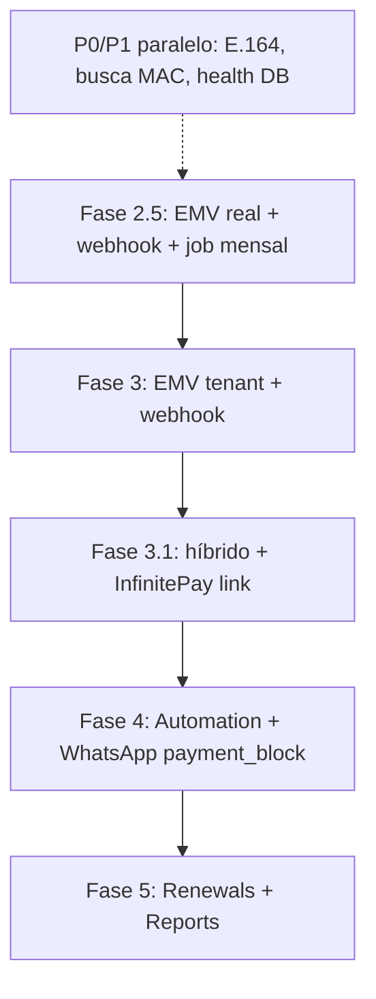

# Status da Implementação — Cliente Manager

Documento vivo: última atualização após **documentação de pagamento híbrido** (EMV copia e cola + link InfinitePay; PushinPay; contratos `PaymentProvider.createCharge`; WhatsApp `{{payment_block}}`).

Relacionado: [10-billing-dual-layer.md](./10-billing-dual-layer.md) · [03-integrations-pix-whatsapp.md](./03-integrations-pix-whatsapp.md) · [09-improvements-p0-p1.md](./09-improvements-p0-p1.md)

---

## Resumo executivo

| Fase | Escopo | Status |
|------|--------|--------|
| **1** | App do revendedor (CRUD, dashboard, tags, conexões) | ✅ Concluída |
| **2** | Painel admin plataforma | ✅ Concluída |
| **2.5** | **Cobrança plataforma → tenant** (SaaS mensal) | ⚠️ **Parcial (MVP UI + API stub)** |
| **3** | Cobrança tenant → cliente final (pagamento, faturas) | ⚠️ **Parcial (mesmo motor, scope tenant)** |
| **3.1** | **Pagamento híbrido** (EMV + checkout link) | 📋 **Doc pronta; código pendente** |
| **4** | Automação D-N + WhatsApp | 📋 Planejada |
| **5** | Renovações pós-pagamento + relatórios | 📋 Planejada |

**Próximo foco recomendado:** adapters EMV reais (Asaas + Mercado Pago), webhooks idempotentes, depois campos híbridos (`paymentDeliveryType`, `checkoutUrl`) + InfinitePay.

---

## ✅ Fase 1 — App do revendedor

### Passo 1 — Scaffold e core
**Status:** Concluído  
- Monorepo, auth JWT com `tenantId`, Prisma, PWA, AppShell responsivo

### Passo 2 — Catálogo (planos, servidores, tags)
**Status:** Concluído  
- CRUD isolado por tenant; tags embutidas em clientes/planos/servidores (sem módulo tags standalone na UI)

### Passo 3 — Clientes e conexões
**Status:** Concluído  
- CRUD clientes, conexões (MAC, servidor, app), cascade delete, máscara MAC hex

### Passo 7 (parcial) — Dashboard tenant
**Status:** Concluído (KPIs básicos, vencimentos próximos, KPIs de billing)  
- Pendente: KPI “renovações pendentes” (depende Fase 5)

### Ajustes de UX/UI (transversal)
**Status:** Concluído  
- Paginação + busca unificadas (`usePaginatedList`, `PageHeaderActions`, `ListPagination`)
- **Filtros modais** em clientes, planos, servidores, faturas e pagamentos (`ListFiltersModal`, badge no header)
- Listas mobile em cards (`ResponsiveDataGrid`), linhas clicáveis em billing
- Modal de confirmação responsivo (action sheet mobile)
- `CustomerStatus` enum, `requireTenantId`, DTO leve de listagem
- Busca de clientes inclui **nome e telefone** na API

---

## ✅ Fase 2 — Painel admin (plataforma)

**Status:** Concluído

| Entrega | Detalhe |
|---------|---------|
| Auth admin | Login separado (`adminToken`), perfil, troca de senha |
| Contas (tenants) | Listagem paginada + busca (nome, slug, e-mail owner) |
| CRUD conta | Criar tenant + owner + **vencimento SaaS** (`nextDueDate`), editar status/vencimento |
| Fatura SaaS por conta | Botão na listagem → `POST /admin/tenants/:id/invoices` |
| Reset senha | Modal por conta |
| Dashboard admin | KPIs + billing SaaS (MRR, inadimplência, gráfico mensal) |
| Shell admin | `AdminShell` com nav: contas, faturas SaaS, pagamentos, configurações |

---

## ⚠️ Fase 2.5 — Cobrança plataforma → tenant

**Objetivo:** o **admin** cobra cada **tenant** mensalmente pelo uso do Cliente Manager (SaaS).

**Documentação:** [10-billing-dual-layer.md](./10-billing-dual-layer.md)

### Entregue (MVP)

| Item | Status |
|------|--------|
| Prisma: `Invoice`, `Payment`, configs plataforma/tenant, assinatura SaaS | ✅ |
| Migrations + seed billing (`npm run seed:billing -w apps/api`) | ✅ |
| Módulo `apps/api/modules/billing` (`scope: platform \| tenant`) | ✅ |
| **`/admin/settings`** — preço SaaS + provider PIX/WA plataforma | ✅ |
| **`/settings` (tenant)** — providers revenda + “Minha assinatura” read-only | ✅ |
| Admin: `/admin/invoices`, `/admin/payments`, detalhes, cancelar/recriar fatura | ✅ |
| Tenant: `/invoices`, `/payments`, detalhes, cancelar/recriar fatura | ✅ |
| Dashboards admin + tenant com KPIs e pagamentos recentes | ✅ |
| Pagamento stub + baixa manual (`generate-pix`, `mark-paid`) | ✅ stub (só EMV fake) |
| Filtros de listagem (status, ciclo, datas) | ✅ |

### Pendente (critério de pronto)

| Item | Status |
|------|--------|
| Adapter EMV real (Asaas) na conta plataforma | ❌ |
| Webhook idempotente → baixa automática (`/webhooks/payment/...`) | ❌ |
| Job mensal automático (`billing_cycle_key`) | ❌ |
| Suspensão automática por inadimplência | ❌ |
| Tenant: copiar PIX da fatura SaaS em Configurações | ⚠️ parcial (via listagem/detalhe) |
| Roteamento multi-PSP por valor (plataforma) | 📋 doc — backlog (MVP tenant primeiro) |

**Critério de pronto:** admin gera fatura de março; tenant paga via PIX sandbox; webhook marca paga; dashboard admin mostra receita do mês.

---

## ⚠️ Fase 3 — Cobrança tenant → cliente final

Reutiliza o **mesmo motor** com `scope = tenant`.

### Entregue

| Item | Status |
|------|--------|
| Faturas + pagamentos por tenant (API + UI) | ✅ |
| Config PIX tenant em `/settings` (legado 1 PSP) | ✅ |
| **Credenciais multi-PSP** (`tenant_payment_credentials`) | ✅ |
| **`PaymentRouter`** — regras `minAmountCents` → provider | ✅ |
| Migration + `Invoice.paymentProvider` | ✅ |
| **Settings:** meios de pagamento + escolha automática por valor + simulador | ✅ |
| `generate-pix` (stub) persiste `paymentProvider` via router | ✅ |
| Detalhe fatura: badge do provider PIX | ✅ |
| Cancelamento + fatura substituta (histórico preservado) | ✅ |
| Filtros em faturas/pagamentos | ✅ |
| Testes unitários `PaymentRouterService` | ✅ |
| Documentação roteamento por valor | ✅ |

### Pendente

| Item | Status |
|------|--------|
| PIX real por tenant (Asaas + PSP percentual EMV) | ❌ |
| Webhook por tenant slug **e** provider | ❌ |
| Faturas no detalhe do cliente | ❌ |
| P0.3 idempotência webhook, P0.5 copiar PIX + wa.me | ❌ |
| Job D-N automático | ❌ (Fase 4) |

---

## 📋 Fase 3.1 — Pagamento híbrido (EMV + link)

**Documentação:** [03-integrations-pix-whatsapp.md](./03-integrations-pix-whatsapp.md) · [10-billing-dual-layer.md](./10-billing-dual-layer.md#fase-31--pagamento-híbrido-emv--link)

| Item | Status |
|------|--------|
| Doc: dois formatos (`emv` \| `checkout_link`) | ✅ |
| Doc: PushinPay (EMV) + InfinitePay (link no Zap) | ✅ |
| Doc: contrato `PaymentProvider.createCharge` | ✅ |
| Doc: WhatsApp `{{payment_block}}` | ✅ |
| Migration `paymentDeliveryType`, `checkoutUrl` | ❌ |
| `generatePayment` (alias `generate-pix`) | ❌ |
| Adapters Asaas + Mercado Pago (EMV) | ❌ |
| Adapter InfinitePay (`checkoutUrl`) | ❌ |
| Adapter PushinPay (opcional) | ❌ |
| UI: copiar PIX vs abrir/copiar link | ❌ |
| Enum Prisma: `pushinpay`, `infinitypay` | ❌ |

---

## Melhorias P0 / P1 (parcial)

| Item | Status |
|------|--------|
| P0.2 Health check | ⚠️ Parcial (`GET /health` sem checagem DB/Redis) |
| P0.6 Telefone E.164 | ❌ Pendente |
| P1.3 Busca global clientes (nome/tel/MAC) | ⚠️ Parcial (nome + tel; MAC pendente) |
| P1.1–P1.2, P1.4–P1.6 | ❌ Pendente |
| P0.3 webhook idempotente | ❌ Pendente (billing stub) |
| Demais P0 (seed unificado, audit, backup) | ❌ Pendente |

Ver checklist completo em [09-improvements-p0-p1.md](./09-improvements-p0-p1.md).

---

## 📋 Fase 4 — Automação + WhatsApp

- Job D-N: fatura + pagamento + template WhatsApp com **`{{payment_block}}`** (PIX ou link)
- Evolution API ou oficial ([03-integrations-pix-whatsapp.md](./03-integrations-pix-whatsapp.md))

---

## 📋 Fase 5 — Renovações + relatórios

- Fila `server_renewal_task` após pagamento confirmado
- `/renewals`, KPI dashboard, audit log (P0.4)

---

## Ordem de implementação sugerida

1. **Integração PSP EMV** (Asaas + Mercado Pago, factory + webhooks platform + tenant)  
2. **Campos híbridos** + adapter InfinitePay (link no Zap)  
3. **Job mensal** de faturas SaaS + tenant  
4. Automação D-N com `payment_block` e renovações  

---

## Débito técnico conhecido

| Item | Notas |
|------|--------|
| Pagamento / webhook | Stub EMV-only; roteamento por valor pronto; falta híbrido + adapters reais + idempotência |
| Providers no código | Enum Prisma ainda só `asaas`, `efi`, `mercadopago` — doc prevê `pushinpay`, `infinitypay` |
| Fatura cancelada na listagem | Permanece no banco; pode “sumir” em páginas seguintes (ordenar/filtrar por status) |
| `FormLayout` legado | Admin/tenant usam `PageLayout` |
| Screenshots na raiz | Não versionados |
| Testes API | Poucos; ampliar com billing |
| CORS / secrets produção | Ver [RELEASE_CHECKLIST.md](./RELEASE_CHECKLIST.md) |

---

## Commits recentes (referência)

- *(doc)* — Pagamento híbrido: EMV + checkout link, PushinPay, InfinitePay, WhatsApp `payment_block`  
- *(anterior)* — Roteamento PSP por valor: migration, API, UI settings, PaymentRouter, docs  
- `069f110` — Núcleo billing, filtros de listagem, cancel/recriar fatura  
- `7118ddf` — Roadmap Fase 2.5 nos guias  
- `6f2cc16` — Admin UI, busca e paginação em contas  
- `d1d524e` — Máscara MAC hex  

---

## 🚀 Próximo passo imediato

1. **`AsaasPaymentProvider`** + **`MercadoPagoPaymentProvider`** (EMV).  
2. **Webhooks** `POST /api/webhooks/payment/platform` e `/:tenantSlug/:provider` com idempotência.  
3. Migration **`paymentDeliveryType`**, **`checkoutUrl`** + **`InfinityPayProvider`** (link).  
4. **`payment-message.util`** + template **`{{payment_block}}`** (preparar Fase 4).  
5. **Job BullMQ** geração mensal de faturas SaaS.
