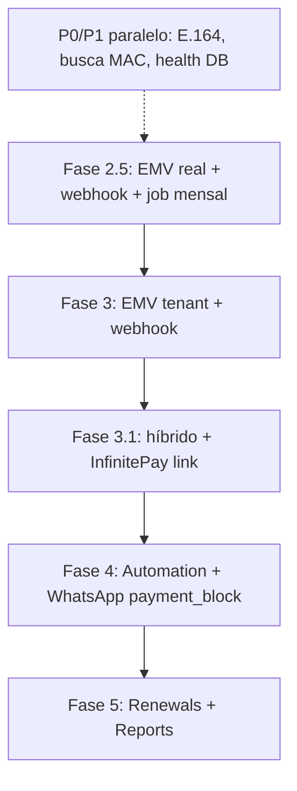

# Status da Implementação — Cliente Manager

Documento vivo: última verificação em **13/06/2026** (épico 20, E.164 universal, escopo produto revisado).

Relacionado: [10-billing-dual-layer.md](./10-billing-dual-layer.md) · [03-integrations-pix-whatsapp.md](./03-integrations-pix-whatsapp.md) · [09-improvements-p0-p1.md](./09-improvements-p0-p1.md) · [11-payment-and-activations.md](./11-payment-and-activations.md) · [12-billing-automation-scheduler.md](./12-billing-automation-scheduler.md)

---

## Verificação Fases 1 e 2 (04/06/2026)

| Critério | Fase 1 | Fase 2 |
|----------|--------|--------|
| **Escopo documentado** | [01-phase-1-tenant-app.md](./01-phase-1-tenant-app.md) passos 1–3 + dashboard | [02-phase-2-admin-panel.md](./02-phase-2-admin-panel.md) |
| **Backend** | Auth tenant, plans, servers, customers, tags, dashboard, billing tenant, activations | Auth admin, tenants CRUD, dashboard admin, billing `scope=platform` |
| **Frontend** | `/dashboard`, `/customers`, `/plans`, `/servers`, `/settings`, `/invoices`, `/payments`, `/activations` | `/admin/*` (login, dashboard, contas, faturas, pagamentos, settings, perfil) |
| **Isolamento tenant** | `requireTenantId`, JWT com `tenantId` | Token `adminToken` separado |
| **Conclusão** | ✅ **Entregue** para o MVP da fase | ✅ **Entregue** para o MVP da fase |

**Fora do escopo estrito das Fases 1–2 (já no repo, tratadas nas fases 2.5 / 3):** faturas e pagamentos tenant, ativações pós-pagamento, cobrança plataforma↔tenant (Mercado Pago real), sync de faturas vencidas.

**Próximo foco do produto:** concluir integrações reais (Fase 2.5 + 3) — adapters PSP, webhooks, jobs — não reabrir Fases 1–2 salvo bugs.

---

## Resumo executivo

| Fase | Escopo | Status |
|------|--------|--------|
| **1** | App do revendedor (CRUD, dashboard, tags, conexões) | ✅ Concluída |
| **2** | Painel admin plataforma | ✅ Concluída |
| **2.5** | **Cobrança plataforma → tenant** (mensal) | ✅ **Concluída** (MP + job + automação) |
| **3** | Cobrança tenant → cliente final (pagamento, faturas) | ✅ **Concluída** (MVP) |
| **3.1** | **Pagamento híbrido** (EMV + checkout link) | 🧊 **Congelada** (doc pronta; MVP usa só MP EMV) |
| **4** | Automação D-N/D+N + WhatsApp | ✅ **Concluída** (MVP) |
| **5** | Renovações pós-pagamento + relatórios | 🚧 **Em andamento** |

**Próximo foco recomendado:** release staging (checklist), relatórios Fase 5 (P1.4 KPI). Itens **fora de escopo** por decisão de produto: observabilidade UI tenant, BullMQ, wa.me nos cards de fatura, busca por MAC.

---

## ✅ Fase 1 — App do revendedor

### Passo 1 — Scaffold e core
**Status:** Concluído  
- Monorepo, auth JWT com `tenantId`, Prisma, PWA, AppShell responsivo

### Passo 2 — Catálogo (planos, servidores, tags)
**Status:** Concluído  
- CRUD isolado por tenant; tags embutidas em clientes/planos/servidores (sem módulo tags standalone na UI)

### Passo 3 — Clientes e conexões
**Status:** Concluído  
- CRUD clientes, conexões (MAC, servidor, app), cascade delete, máscara MAC hex

### Passo 7 (parcial) — Dashboard tenant
**Status:** Concluído  
- KPIs de clientes (total, ativos, vencendo, vencidos), infraestrutura, receita estimada  
- KPIs e gráfico de **cobrança** (recebido, em aberto, vencidas, taxa)  
- Listas: próximos vencimentos, pagamentos recentes, **ativações pendentes** (card + lista)  
- Fila de renovações: `/activations` (alias legado `/renewals`)

### Ajustes de UX/UI (transversal)
**Status:** Concluído  
- Paginação + busca unificadas (`usePaginatedList`, `PageHeaderActions`, `ListPagination`)
- **Filtros modais** em clientes, planos, servidores, faturas e pagamentos (`ListFiltersModal`, badge no header)
- Listas mobile em cards (`ResponsiveDataGrid`), linhas clicáveis em billing
- Modal de confirmação responsivo (action sheet mobile)
- `CustomerStatus` enum, `requireTenantId`, DTO leve de listagem
- Busca de clientes inclui **nome e telefone** na API

---

## ✅ Fase 2 — Painel admin (plataforma)

**Status:** Concluído

| Entrega | Detalhe |
|---------|---------|
| Auth admin | Login separado (`adminToken`), perfil, troca de senha |
| Contas (tenants) | Listagem paginada + busca (nome, slug, e-mail owner) |
| CRUD conta | Criar tenant + owner + **vencimento SaaS** (`nextDueDate`), editar status/vencimento |
| Fatura SaaS por conta | Botão na listagem → `POST /admin/tenants/:id/invoices` |
| Reset senha | Modal por conta |
| Dashboard admin | KPIs + billing SaaS (MRR, inadimplência, gráfico mensal) |
| Shell admin | `AdminShell` com nav: contas, faturas SaaS, pagamentos, configurações |

---

## ✅ Fase 2.5 — Cobrança plataforma → tenant

**Objetivo:** o **admin** cobra cada **tenant** mensalmente pelo uso do PixFlow.

**Documentação:** [10-billing-dual-layer.md](./10-billing-dual-layer.md) · [17-saas-monthly-invoice-job.md](./17-saas-monthly-invoice-job.md) · [20-admin-plans-and-tenant-automation-roadmap.md](./20-admin-plans-and-tenant-automation-roadmap.md)

### Entregue

| Item | Status |
|------|--------|
| Prisma: `Invoice`, `Payment`, configs plataforma/tenant, assinatura, `PlatformPlan` | ✅ |
| Migrations + seed billing (`npm run seed:billing -w apps/api`) | ✅ |
| Módulo billing (`scope: platform \| tenant`) | ✅ |
| **`/admin/settings`** — abas (Geral, Pagamentos, WhatsApp, Cobrança, Automação) | ✅ |
| CRUD **`/admin/plans`** + plano na conta | ✅ |
| Job mensal + fluxo completo (fatura → PIX → WhatsApp) | ✅ |
| Adapter Mercado Pago real + webhook idempotente | ✅ |
| Suspensão automática por inadimplência (opt-in) | ✅ |
| MRR dashboard com preços reais dos planos | ✅ |

**Critério de pronto:** ✅ atendido.

---

## ✅ Fase 3 — Cobrança tenant → cliente final

Reutiliza o **mesmo motor** com `scope = tenant`.

| Item | Status |
|------|--------|
| Faturas + pagamentos (API + UI) | ✅ |
| Credenciais MP + webhook por slug | ✅ |
| Fatura manual, avulsa, cancel/recreate | ✅ |
| Faturas no detalhe do cliente | ✅ |
| Automação D-N + D+N (Feature 19) | ✅ |
| Copiar PIX no **detalhe** da fatura | ✅ |
| Telefone E.164 universal (`phone-e164.ts`) | ✅ |

**Fora de escopo:** wa.me nos cards da listagem; busca cliente por MAC.

---

## 🧊 Fase 3.1 — Pagamento híbrido (EMV + link) — congelada

**Decisão de produto (feature 13):** MVP opera só com Mercado Pago EMV. Checkout link, PushinPay e InfinitePay ficam congelados até reabertura explícita.

**Documentação:** [03-integrations-pix-whatsapp.md](./03-integrations-pix-whatsapp.md) · [10-billing-dual-layer.md](./10-billing-dual-layer.md#fase-31--pagamento-híbrido-emv--link)

| Item | Status |
|------|--------|
| Doc: dois formatos (`emv` \| `checkout_link`) | ✅ |
| Doc: PushinPay (EMV) + InfinitePay (link no Zap) | ✅ |
| Doc: contrato `PaymentProvider.createCharge` | ✅ |
| Doc: WhatsApp `{{payment_block}}` | ✅ |
| Migration `paymentDeliveryType`, `checkoutUrl` | ❌ |
| `generatePayment` (alias `generate-pix`) | ❌ |
| Adapters Asaas + Mercado Pago (EMV) | ✅ |
| Adapter InfinitePay (`checkoutUrl`) | ❌ |
| Adapter PushinPay (opcional) | ❌ |
| UI: copiar PIX vs abrir/copiar link | ❌ |
| Enum Prisma: `pushinpay`, `infinitypay` | ❌ |

---

## Melhorias P0 / P1

| Item | Status |
|------|--------|
| P0.2 Health check | ✅ `/health` com `db: ok|fail` (503 se DB indisponível) |
| P0.3 Webhook idempotente MP | ✅ |
| P0.5 Copiar PIX | ✅ detalhe fatura (cards/wa.me fora de escopo) |
| P0.6 Telefone E.164 | ✅ schemas Zod universalizados |
| P1.3 Busca clientes | ✅ nome + telefone (MAC fora de escopo) |
| P0.4 Audit log | ✅ módulo `audit`, `GET /api/logs`, UI `/logs` |
| P0.7 Backup, P1.1–P1.2, P1.4–P1.6 | ❌ Pendente |

Ver [09-improvements-p0-p1.md](./09-improvements-p0-p1.md).

---

## ✅ Fase 4 — Automação + WhatsApp

**Documentação:** [12-billing-automation-scheduler.md](./12-billing-automation-scheduler.md) · [19-billing-overdue-reminder-automation.md](./19-billing-overdue-reminder-automation.md)

| Item | Status |
|------|--------|
| Scheduler node-cron | ✅ |
| D-N + D+N + faturas avulsas | ✅ |
| Evolution + Meta connect (tenant e admin) | ✅ |
| `{{payment_block}}` no parser (EMV) | ✅ |
| Observabilidade UI tenant | 🚫 Fora de escopo (Feature 15) |
| BullMQ / Redis | 🚫 Fora de escopo |

---

## 🚧 Fase 5 — Renovações + relatórios

| Item | Status |
|------|--------|
| Fila pós-pagamento (`connection_renewal_tasks`) | ✅ |
| UI `/activations` + concluir no servidor | ✅ |
| Alias `/renewals` → `/activations` | ✅ |
| Audit log P0.4 (cliente, pagamento, cobrança WA, ativação) | ✅ |
| UI `/logs` tenant | ✅ |
| KPI dashboard renovações (P1.4) | ❌ Pendente |
| Relatórios diários / pós-pagamento | ❌ Pendente |

Documentação legada: `server_renewal_task` = `connection_renewal_tasks`; rota legada `/renewals` redireciona para `/activations`.

---

## Ordem de implementação sugerida

1. **Integração PSP EMV** (Asaas + Mercado Pago, factory + webhooks platform + tenant)  
2. **Campos híbridos** + adapter InfinitePay (link no Zap)  
3. **Job mensal** de faturas SaaS + tenant  
4. Automação D-N com `payment_block` e renovações  

---

## Débito técnico conhecido

| Item | Notas |
|------|--------|
| Pagamento / webhook | Mercado Pago EMV real; um PSP por tenant/plataforma; idempotência webhook ✅ |
| Providers no código | Enum Prisma ainda só `asaas`, `efi`, `mercadopago` — doc prevê `pushinpay`, `infinitypay` |
| Fatura cancelada na listagem | Permanece no banco; pode “sumir” em páginas seguintes (ordenar/filtrar por status) |
| `FormLayout` legado | Admin/tenant usam `PageLayout` |
| Screenshots na raiz | Não versionados |
| Testes API | Poucos; ampliar com billing |
| CORS / secrets produção | Ver [RELEASE_CHECKLIST.md](./RELEASE_CHECKLIST.md) |

---

## Commits recentes (referência)

- `8c36b15` — Settings PIX: um provider + combobox; perfil sem exibir `role`  
- `2812876` — Billing overdue sync, modal único, dashboard ativações, UX cliente/fatura  
- `069f110` — Núcleo billing, filtros de listagem, cancel/recriar fatura  
- `7118ddf` — Roadmap Fase 2.5 nos guias  
- `6f2cc16` — Admin UI, busca e paginação em contas  
- `d1d524e` — Máscara MAC hex  

---

## 🚀 Roadmap de features (pós Fase 2)

| # | Feature | Doc | Status |
|---|---------|-----|--------|
| 13 | Mercado Pago único + erros API→UI | [13](./13-mercadopago-only-and-api-errors.md) | ✅ Concluída |
| 14 | Overhaul painel admin | [14](./14-admin-panel-overhaul.md) | ✅ Concluída |
| 15 | Automação: observabilidade | [15](./15-billing-automation-observability.md) | 🚫 Fora de escopo |
| 16 | WhatsApp pós-pagamento + templates | [16](./16-whatsapp-payment-notification-and-templates.md) | ✅ código (notificação pós-pagamento) |
| 17 | Job mensal faturas plataforma | [17](./17-saas-monthly-invoice-job.md) | ✅ Concluída |
| 18 | Pagamento híbrido (link) | [18](./18-payment-delivery-hybrid-frozen.md) | 🧊 Congelada |
| 19 | Lembretes pós-vencimento (D+N) | [19](./19-billing-overdue-reminder-automation.md) | ✅ Concluída |
| 20 | Planos admin + automação plataforma | [20](./20-admin-plans-and-tenant-automation-roadmap.md) | ✅ Concluída |

### Plano: WhatsApp para o tenant (recebimentos)

| Etapa | Entrega | Status |
|-------|---------|--------|
| W1 | Evolution configurável em `/settings` (URL + API key) | ✅ |
| W2 | Enviar cobrança PIX ao **cliente** (`send-charge`) | ✅ |
| W3 | **Aviso ao tenant** após pagamento confirmado (webhook ou manual) | ✅ código |
| W4 | Campo **telefone** na conta (admin) | ✅ |
| W5 | Meta Cloud API (provider `meta`) | ✅ Embedded Signup |
| W6 | Template `{{payment_block}}` em jobs D-N | 📋 Fase 4 |

**W3 (implementado):** `PaymentReceivedNotificationService` dispara após `PaymentConfirmationService.confirm` (scope `tenant`). Usa telefone da **conta** ou `PAYMENT_NOTIFY_PHONE` no `.env` da API. Falha no Zap não reverte a baixa.
